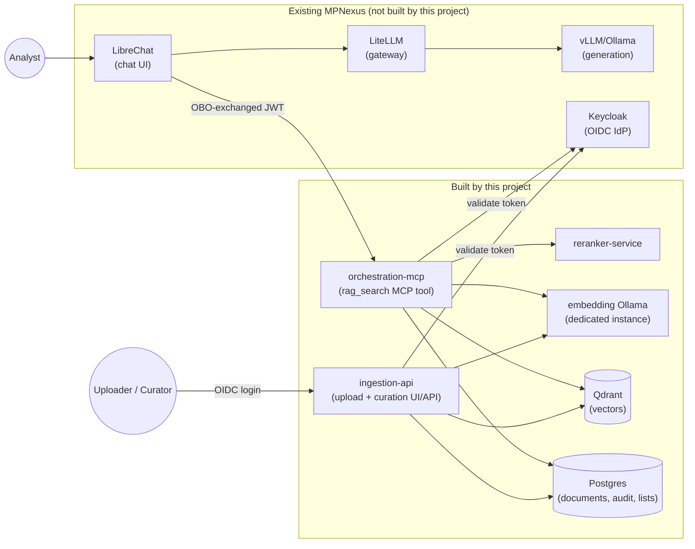
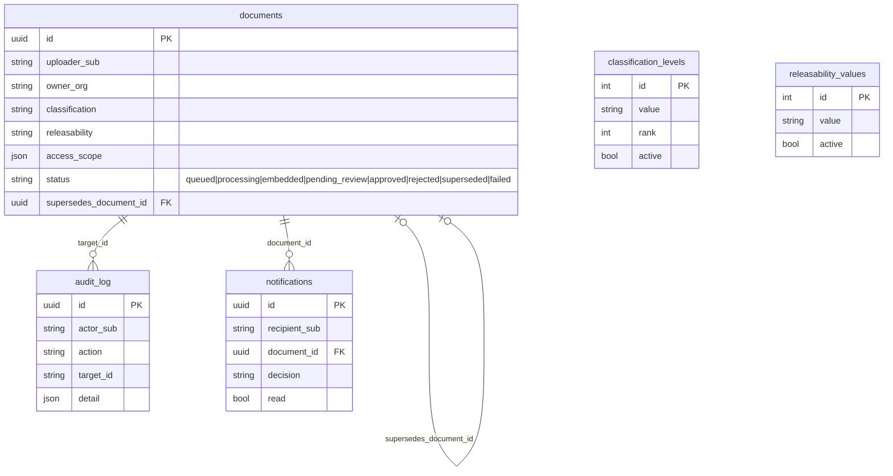
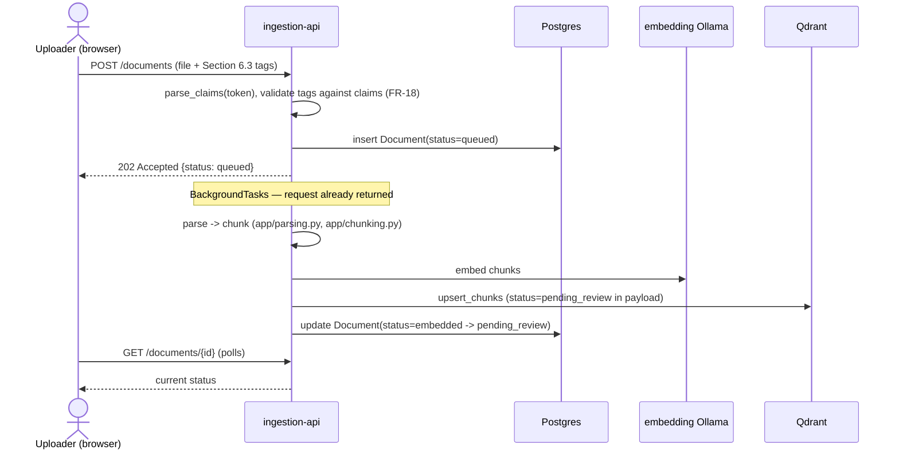
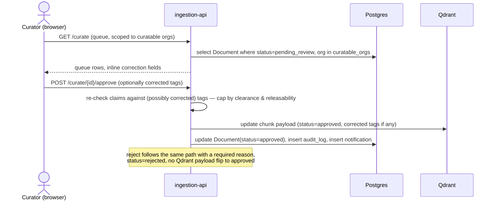
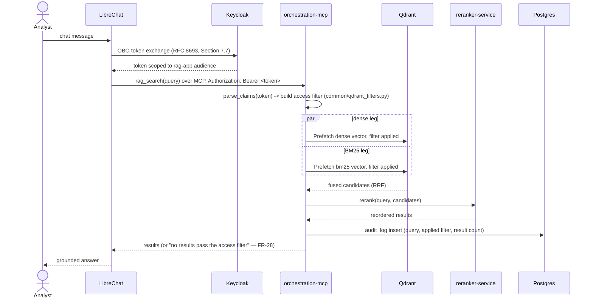
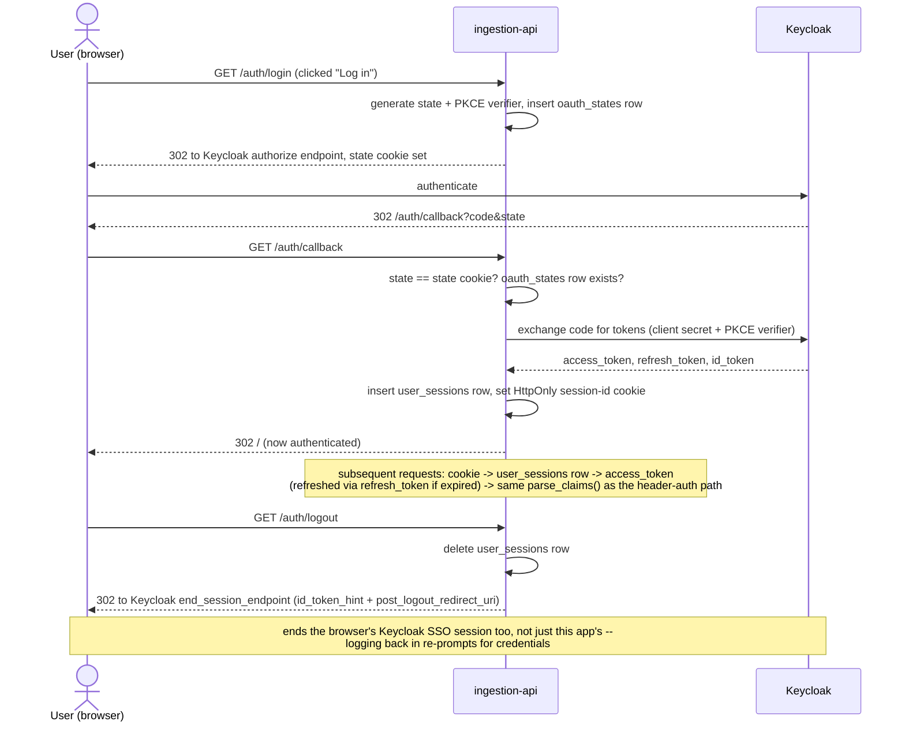
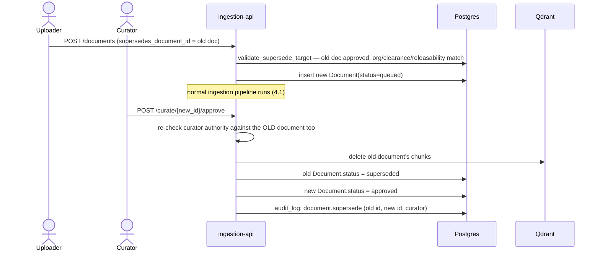
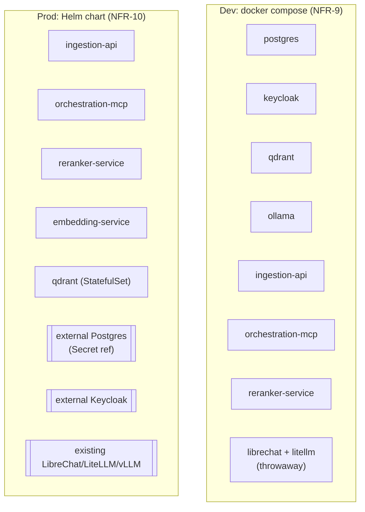

# Architecture

A visual companion to [REQUIREMENTS.md](REQUIREMENTS.md) — this document shows how the
pieces fit together and how data moves through them. It describes what's actually built
(see `docs/dev-setup.md`'s "What's stubbed vs working" for the authoritative, current
list) plus one flow that's designed but not yet implemented, called out explicitly where
it appears.

## 1. System overview

Everything in the `new` box is what this repo adds; everything in `existing` is assumed
already deployed and managed separately (NFR-10). The dev Compose stack (NFR-9) stands up
throwaway copies of the `existing` box too, so the whole diagram runs on a laptop.

## 2. Component inventory

| Component | Built here? | Tech | Role |
|---|---|---|---|
| `ingestion-api` | Yes | FastAPI + Jinja2/HTMX | Upload, mandatory tagging, curation queue, admin lists, notifications — both the browser UI and its REST API |
| `orchestration-mcp` | Yes | FastMCP (Python MCP SDK) | Exposes `rag_search` to LibreChat; builds the claims-based Qdrant filter, runs hybrid retrieval + rerank |
| `reranker-service` | Yes | FastAPI + sentence-transformers `CrossEncoder` | Scores/reorders fused retrieval candidates |
| `common` | Yes | Python package | Shared claims parsing, metadata schema, Qdrant filter builder, DB models — the single source of truth both services import rather than reimplement |
| embedding Ollama | Config only | Ollama | Dedicated embedding-serving instance (NFR-8: separate GPU allocation from generation) |
| Qdrant | Config only | Qdrant | Vector store — dense + BM25 named vectors per chunk, access-control payload fields |
| Postgres | Config only | Postgres | System of record: document status, audit log, notifications, admin-configurable classification/releasability lists |
| Keycloak | External | Keycloak | OIDC IdP — realm/users/roles seeded for dev, external in prod |
| LibreChat / LiteLLM / generation vLLM/Ollama | External | — | Existing MPNexus chat + generation stack this project layers onto |

## 3. Data model

Postgres is the transactional system of record (status, audit, admin lists). Qdrant holds
the actual chunk vectors — one point per chunk, two named vectors (`dense`, `bm25`) — plus
a copy of the access-control fields (`status`, `classification`, `releasability`,
`access_scope`) as payload, so retrieval can filter without a round trip to Postgres.

## 4. Major flows

### 4.1 Ingestion (FR-1..FR-9)

### 4.2 Curation (FR-10..FR-16)

### 4.3 Query / retrieval (FR-24..FR-29)

The access filter (`status=approved` + `classification` at-or-below clearance +
`releasability` match + `access_scope` match) is built entirely server-side from the
verified token — never from anything the client/LibreChat supplies — which is what makes
FR-26 non-bypassable.

`orchestration-mcp` also exposes this same logic as a plain REST endpoint,
`POST /debug/rag_search`, for curl-based testing without an MCP client (§4.4's ingestion
UI has a `/search` page that's a thin proxy over this same endpoint, forwarding the
logged-in user's own session token — no enforcement logic duplicated in `ingestion-api`,
it's still all in `orchestration-mcp`).

### 4.4 Ingestion UI login

Replaces the old pasted-access-token dev workaround. Page routes (`GET /`, `/curate`, ...)
still render unauthenticated — there's no forced redirect on page load — but every
underlying fetch call (upload, curate, notifications) now rides a session cookie instead
of a manually-attached header. The nav shows "Log in" when logged out, or the current
user's `preferred_username` plus "Log out" when logged in.

Implementation notes:
- `rag-app` is already a confidential client with a secret in the realm export, so no new
  Keycloak config was needed — `app/routes/auth.py` and `app/deps.py`.
- Tokens live in a new Postgres `user_sessions` table (`common/models.py`), not in the
  cookie itself — keeps the token out of JS-reachable storage and makes a session
  individually revocable. `oauth_states` is a matching short-lived table for the
  login-in-progress `state`/PKCE `code_verifier` pair.
- The existing header-based `get_current_user` path is untouched for API/MCP callers;
  it now checks the session cookie first and falls back to the Authorization header — no
  forked enforcement logic between browser and API callers. `get_current_user_optional`
  (used only by the three page routes, for the nav's username display) is the same
  resolution but returns `None` instead of raising on an anonymous visitor.
- The paste-a-token box was retired outright (not kept behind a flag) rather than running
  two parallel auth UX paths.
- Logout uses `id_token_hint` (the `id_token` captured at `/callback`) rather than just
  `client_id`, since newer Keycloak versions reject the latter for RP-initiated logout.
- Helm chart wiring: `externalKeycloak.clientId`/`.clientSecret` (Secret-backed, same
  pattern as `externalPostgres`) and `ingestionApi.oidcRedirectUri` (derived from
  `ingress.host`/`ingress.tls` if not set explicitly, via `_helpers.tpl`'s
  `nexus-rag.oidcRedirectUri` — fails the render rather than deploying a broken callback
  URL if neither is available) / `.cookieSecure`. Like the rest of the chart, unverified by
  `helm lint`/`helm template` — see `docs/dev-setup.md`'s "Stubbed / TODO" list.

### 4.5 Re-ingestion / versioning (FR-7)

## 5. Security model

Single enforcement principle: every claim-gated decision — what a user may *tag* a
document with (FR-18), what a curator may *approve* (FR-14), and what a query may
*retrieve* (FR-26) — is derived from the same verified OIDC claims via `common/claims.py`,
never from client-supplied values. Two independent enforcement points share one library
rather than reimplementing the check:

| Enforcement point | Where | What it checks |
|---|---|---|
| Ingest-time tagging | `ingestion-api` upload route | Classification/Releasability offered ≤ uploader's clearance/releasability |
| Curation | `ingestion-api` curate route | Approving curator holds `rag-curate:<org>` for the doc's org, and clearance/releasability cover the (possibly corrected) tags |
| Query-time retrieval | `orchestration-mcp` | Qdrant filter restricts to `approved` + classification ≤ clearance + releasability match + access_scope match |
| Audit | Both services, `audit_log` table | Every submit/approve/reject/supersede/query is recorded against the actor's `sub`, not a self-reported name |

## 6. Deployment topology

Dev stands up *everything*, including throwaway LibreChat/LiteLLM/Keycloak instances, so
the full OBO/MCP flow can be exercised locally. The Helm chart deploys only the boxes in
the `new` component table (§2) — Postgres and Keycloak are referenced via `values.yaml`
(`externalPostgres.existingSecret`, `externalKeycloak.issuerUrl`), not deployed by the
chart.

## 7. Known gaps

See `docs/dev-setup.md`'s "What's stubbed vs working" for the current, authoritative list
(kept there rather than duplicated here, since it changes as work lands). Notable ones as
of this writing: §4.4's browser OIDC login, Keycloak OBO admin-console steps that can't be
expressed in the realm-export JSON, and `librechat.yaml`'s schema not yet validated against
a running LibreChat instance.
