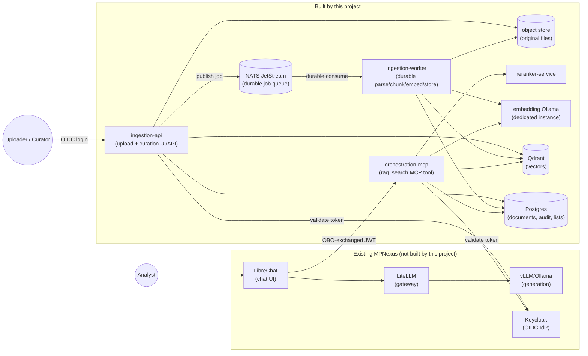
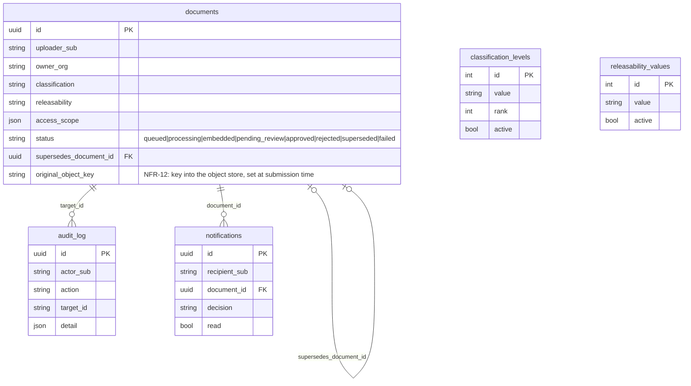
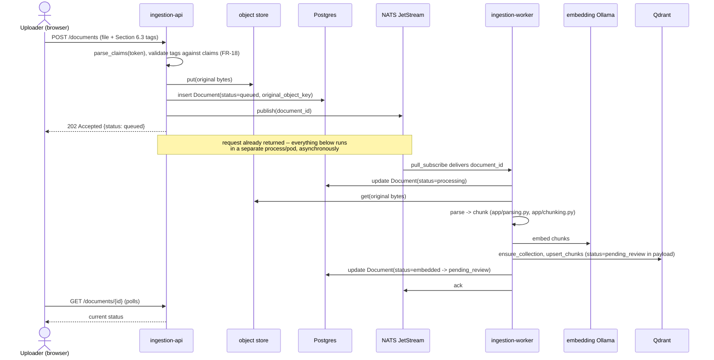
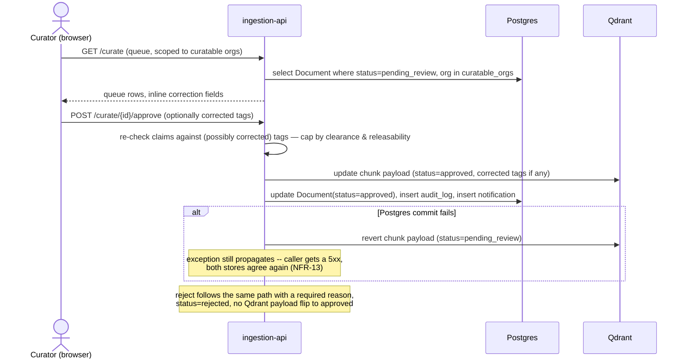
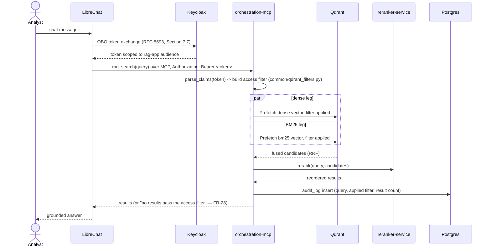
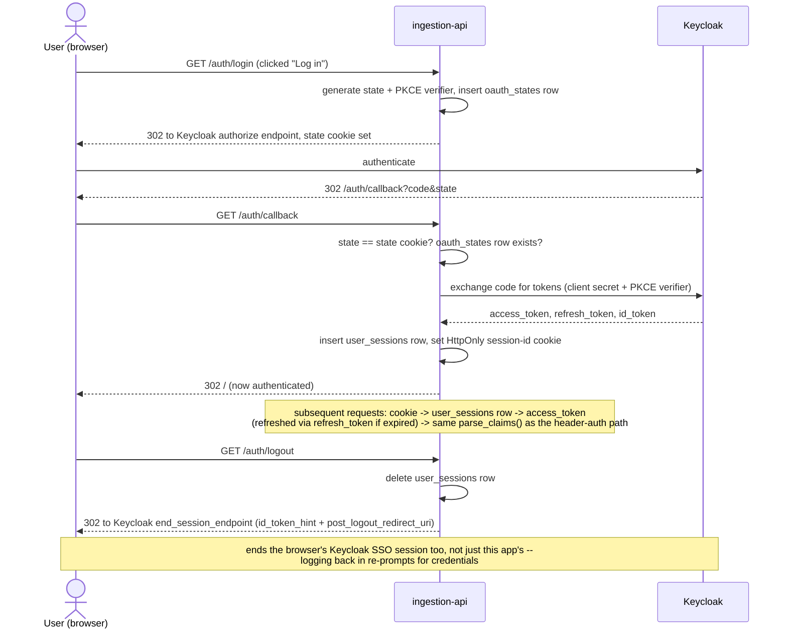
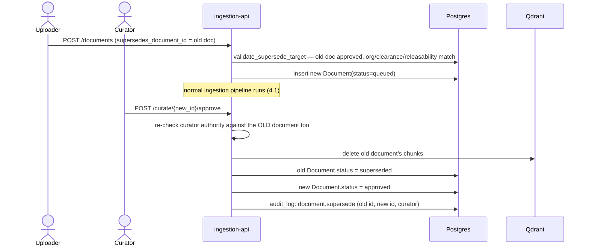
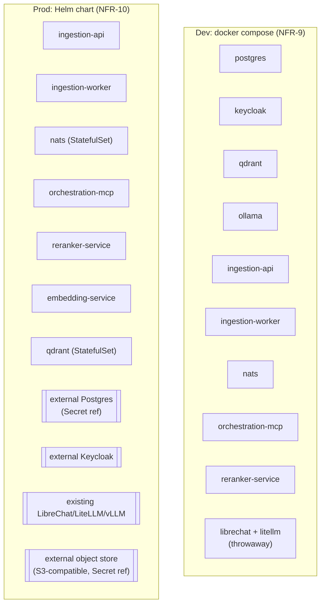

# Architecture

A visual companion to [REQUIREMENTS.md](REQUIREMENTS.md) — this document shows how the
pieces fit together and how data moves through them. It describes what's actually built
(see `docs/dev-setup.md`'s "What's stubbed vs working" for the authoritative, current
list) plus one flow that's designed but not yet implemented, called out explicitly where
it appears.

## 1. System overview

Everything in the `new` box is what this repo adds; everything in `existing` is assumed
already deployed and managed separately (NFR-10). The dev Compose stack (NFR-9) stands up
throwaway copies of the `existing` box too, so the whole diagram runs on a laptop.

## 2. Component inventory

| Component | Built here? | Tech | Role |
|---|---|---|---|
| `ingestion-api` | Yes | FastAPI + Jinja2/HTMX | Upload, mandatory tagging, curation queue, admin lists, notifications — both the browser UI and its REST API. Validates and durably stages a submission (Postgres row + object-store write), then publishes a job rather than processing it itself |
| `ingestion-worker` | Yes | FastAPI (health-check only) + a NATS JetStream pull consumer | Durable parse/chunk/embed/store pipeline (FR-3..FR-6), moved out of `ingestion-api`'s request path (NFR-11) |
| `orchestration-mcp` | Yes | FastMCP (Python MCP SDK) | Exposes `rag_search` to LibreChat; builds the claims-based Qdrant filter, runs hybrid retrieval + rerank |
| `reranker-service` | Yes | FastAPI + sentence-transformers `CrossEncoder` | Scores/reorders fused retrieval candidates |
| `common` | Yes | Python package | Shared claims parsing, metadata schema, Qdrant filter builder, DB models, object-store abstraction (NFR-12), NATS job-queue helpers (NFR-11) — the single source of truth every service imports rather than reimplements |
| NATS JetStream | Config only | NATS | Durable, token-authenticated ingestion job queue between `ingestion-api` and `ingestion-worker` (NFR-11) |
| object store | Config only | Filesystem (dev) / any S3-compatible endpoint (prod) | Durable storage for original uploaded files, independent of Qdrant/Postgres (NFR-12) |
| embedding Ollama | Config only | Ollama | Dedicated embedding-serving instance (NFR-8: separate GPU allocation from generation) |
| Qdrant | Config only | Qdrant | Vector store — dense + BM25 named vectors per chunk, access-control payload fields |
| Postgres | Config only | Postgres | System of record: document status, audit log, notifications, admin-configurable classification/releasability lists |
| Keycloak | External | Keycloak | OIDC IdP — realm/users/roles seeded for dev, external in prod |
| LibreChat / LiteLLM / generation vLLM/Ollama | External | — | Existing MPNexus chat + generation stack this project layers onto |

## 3. Data model

Postgres is the transactional system of record (status, audit, admin lists). Qdrant holds
the actual chunk vectors — one point per chunk, two named vectors (`dense`, `bm25`) — plus
a copy of the access-control fields (`status`, `classification`, `releasability`,
`access_scope`) as payload, so retrieval can filter without a round trip to Postgres. The
object store (NFR-12) holds the original uploaded bytes, keyed by `original_object_key` on
the `documents` row — independent of both, so the source file survives regardless of what
happens to either the vector or metadata copy.

## 4. Major flows

### 4.1 Ingestion (FR-1..FR-9, durable via NFR-11/NFR-12)

Implementation notes:
- **Why a queue, not `BackgroundTasks`:** the previous in-process design lost queued/
  in-flight documents on a process restart or crash mid-processing — nothing recorded
  that work needed to happen again. JetStream's ack/redelivery semantics fix that: `W`
  only acks the message on a terminal outcome. A success or a *permanent* failure
  (`ParsingError`/`EmbeddingError` — corrupt/unsupported input, an embedding request the
  service rejects outright) lands the document in `failed` and acks, since retrying the
  identical input wouldn't help. An *unexpected/transient* error (Qdrant or Postgres
  unreachable, a bug) is deliberately left un-acked, so JetStream redelivers the message
  to another attempt (this worker's next poll, or a different replica) after its
  `ack_wait` timeout — see `services/ingestion-worker/app/processing.py`.
- **Why a separate object store, not just the request's in-memory bytes:** before NFR-12,
  the original file only existed in memory/`/tmp` for the lifetime of a single
  `BackgroundTask` — nothing to hand off to a separate worker process, and nothing left
  if that process died before finishing. `common/object_store.py`'s `ObjectStore`
  abstraction (filesystem in dev, S3-compatible in prod) durably persists the bytes
  *before* the 202 response returns, keyed by `document_object_key(document_id)`; `W`
  reads it back independently rather than receiving it as an argument.
- **Qdrant credentials:** `ingestion-worker` now holds the full read/write Qdrant key
  (it's the one that calls `ensure_collection`/`upsert_chunks`); `ingestion-api` keeps
  its own full key too, since curation (§4.2) still updates/deletes points directly.

### 4.2 Curation (FR-10..FR-16)

**NFR-13 (safe supersession under partial failure):** validation (curator authority,
supersede-chain checks — see §4.5) already runs before *any* mutation, Qdrant or Postgres.
Given that, the Qdrant write happens before the Postgres commit rather than after: if
`session.commit()` came first, a curator could never retry a failed sync through the same
API call, since `_load_pending` only accepts a document still in `pending_review`, and
Postgres would already say `approved`. Writing Qdrant first, then committing, keeps the
document retry-able for as long as the commit hasn't happened. The cost is the reverse
failure mode: if something *between* the Qdrant write and the commit raises (a DB error, the
old document's Qdrant chunk delete failing on a supersede), Postgres rolls back to
`pending_review`, but the Qdrant write doesn't roll back with it — leaving Qdrant already
showing `approved`/`rejected`, and therefore already affecting retrieval (FR-11/FR-26
filtering reads Qdrant's payload, not the Postgres row), while Postgres and the curation
queue both still call the document `pending_review`. `approve()`/`reject()` close that gap:
they wrap the sequence in a `try`/`except` that best-effort reverts the Qdrant write back to
`pending_review` on any failure before re-raising, so the two stores can't end up
disagreeing about a document's status.

### 4.3 Query / retrieval (FR-24..FR-29)

The access filter (`status=approved` + `classification` at-or-below clearance +
`releasability` match + `access_scope` match) is built entirely server-side from the
verified token — never from anything the client/LibreChat supplies — which is what makes
FR-26 non-bypassable.

`orchestration-mcp` also exposes this same logic as a plain REST endpoint,
`POST /debug/rag_search`, for curl-based testing without an MCP client (§4.4's ingestion
UI has a `/search` page that's a thin proxy over this same endpoint, forwarding the
logged-in user's own session token — no enforcement logic duplicated in `ingestion-api`,
it's still all in `orchestration-mcp`).

**Prompt-injection mitigation (P1):** retrieved chunk `text` is untrusted by construction —
it's whatever an uploader submitted, and FR-18's tagging validation constrains metadata, not
document content. `run_rag_search()` (`app/rag_search.py`) delimits every result's `text`
with an explicit `<untrusted_document_content>` marker (applied *after* reranking, so
`reranker-service`'s cross-encoder still scores the raw text) and adds a `security_notice`
field to the response instructing the calling model to treat delimited content as reference
material to cite, not instructions to follow — the same marker-plus-notice pattern also
carried in the tool's own MCP docstring, so it doesn't depend on one particular client
surfacing docstrings to its model. This is a mitigation, not a guarantee (§7).

### 4.4 Ingestion UI login

Replaces the old pasted-access-token dev workaround. Page routes (`GET /`, `/curate`, ...)
still render unauthenticated — there's no forced redirect on page load — but every
underlying fetch call (upload, curate, notifications) now rides a session cookie instead
of a manually-attached header. The nav shows "Log in" when logged out, or the current
user's `preferred_username` plus "Log out" when logged in.

Implementation notes:
- `rag-app` is already a confidential client with a secret in the realm export, so no new
  Keycloak config was needed — `app/routes/auth.py` and `app/deps.py`.
- Tokens live in a new Postgres `user_sessions` table (`common/models.py`), not in the
  cookie itself — keeps the token out of JS-reachable storage and makes a session
  individually revocable. `oauth_states` is a matching short-lived table for the
  login-in-progress `state`/PKCE `code_verifier` pair.
- The existing header-based `get_current_user` path is untouched for API/MCP callers;
  it now checks the session cookie first and falls back to the Authorization header — no
  forked enforcement logic between browser and API callers. `get_current_user_optional`
  (used only by the three page routes, for the nav's username display) is the same
  resolution but returns `None` instead of raising on an anonymous visitor.
- The paste-a-token box was retired outright (not kept behind a flag) rather than running
  two parallel auth UX paths.
- Logout uses `id_token_hint` (the `id_token` captured at `/callback`) rather than just
  `client_id`, since newer Keycloak versions reject the latter for RP-initiated logout.
- Helm chart wiring: `externalKeycloak.clientId`/`.clientSecret` (Secret-backed, same
  pattern as `externalPostgres`) and `ingestionApi.oidcRedirectUri` (derived from
  `ingress.host`/`ingress.tls` if not set explicitly, via `_helpers.tpl`'s
  `nexus-rag.oidcRedirectUri` — fails the render rather than deploying a broken callback
  URL if neither is available) / `.cookieSecure`. Like the rest of the chart, unverified by
  `helm lint`/`helm template` — see `docs/dev-setup.md`'s "Stubbed / TODO" list.
- CSRF protection (NFR-14): a second, non-`HttpOnly` cookie (`nexus_rag_csrf`) set
  alongside the session cookie — the session cookie alone would ride along on a forged
  cross-site request, but only this app's own JS can read the CSRF cookie's value to echo
  it back as a header, which a cross-site attacker can't. `deps.verify_csrf` checks
  cookie == header on every state-changing route, and is a no-op for bearer-token callers
  (no session cookie means nothing CSRF can forge in the first place).

### 4.5 Re-ingestion / versioning (FR-7)

Ordering matters here (NFR-13): the *new* document's Qdrant chunks are flipped to
`approved` — see §4.2's diagram — *before* the old document's chunks are deleted, and
`_validate_supersede` re-checks the whole chain (old document still `approved`, curator's
authority over the old document specifically, not just the new one) before any of this
runs. That's what guarantees there's never a window where neither version is retrievable:
worst case, both are briefly retrievable at once, which REQUIREMENTS.md's NFR-13 calls out
as the acceptable, preferable outcome over the alternative.

## 5. Security model

Single enforcement principle: every claim-gated decision — what a user may *tag* a
document with (FR-18), what a curator may *approve* (FR-14), and what a query may
*retrieve* (FR-26) — is derived from the same verified OIDC claims via `common/claims.py`,
never from client-supplied values. Two independent enforcement points share one library
rather than reimplementing the check:

| Enforcement point | Where | What it checks |
|---|---|---|
| Ingest-time tagging | `ingestion-api` upload route | Classification/Releasability offered ≤ uploader's clearance/releasability |
| Curation | `ingestion-api` curate route | Approving curator holds `rag-curate:<org>` for the doc's org, and clearance/releasability cover the (possibly corrected) tags |
| Query-time retrieval | `orchestration-mcp` | Qdrant filter restricts to `approved` + classification ≤ clearance + releasability match + access_scope match |
| Audit | Both services, `audit_log` table | Every submit/approve/reject/supersede/query is recorded against the actor's `sub`, not a self-reported name |

## 6. Deployment topology

Dev stands up *everything*, including throwaway LibreChat/LiteLLM/Keycloak instances, so
the full OBO/MCP flow can be exercised locally. The Helm chart deploys only the boxes in
the `new` component table (§2) — Postgres, Keycloak, and the object store are referenced
via `values.yaml` (`externalPostgres.existingSecret`, `externalKeycloak.issuerUrl`,
`externalObjectStore.endpoint`/`.bucket`), not deployed by the chart.

## 7. Known gaps

See `docs/dev-setup.md`'s "What's stubbed vs working" for the current, authoritative list
(kept there rather than duplicated here, since it changes as work lands). Notable ones as
of this writing: §4.4's browser OIDC login, Keycloak OBO admin-console steps that can't be
expressed in the realm-export JSON, `librechat.yaml`'s `mcpServers` shape (checked against a
real LibreChat 0.8.7 instance -- fixed a real schema mismatch, `obo.scopes` needs a
space-delimited string not a JSON array -- but the OBO exchange itself still isn't exercised
end to end), §4.1's NATS-based durable ingestion pipeline
(`ingestion-worker`, NFR-11) — the largest structural change in the current hardening
batch, verified only with mocks in this sandbox (no live NATS/Postgres/Qdrant available),
not yet exercised against a real `docker compose up` — and §4.3's prompt-injection
mitigation, which has no regression test proving a real generation model actually respects
the delimiter/notice (needs a live LibreChat + generation model, same gap as the P1
tool-invocation regression test).
