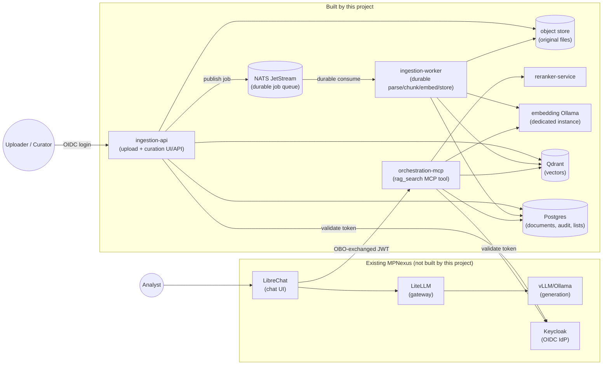
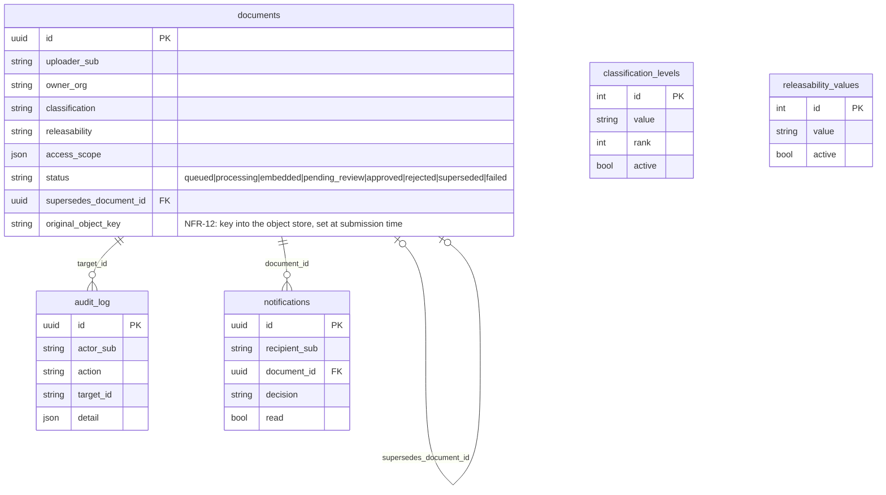
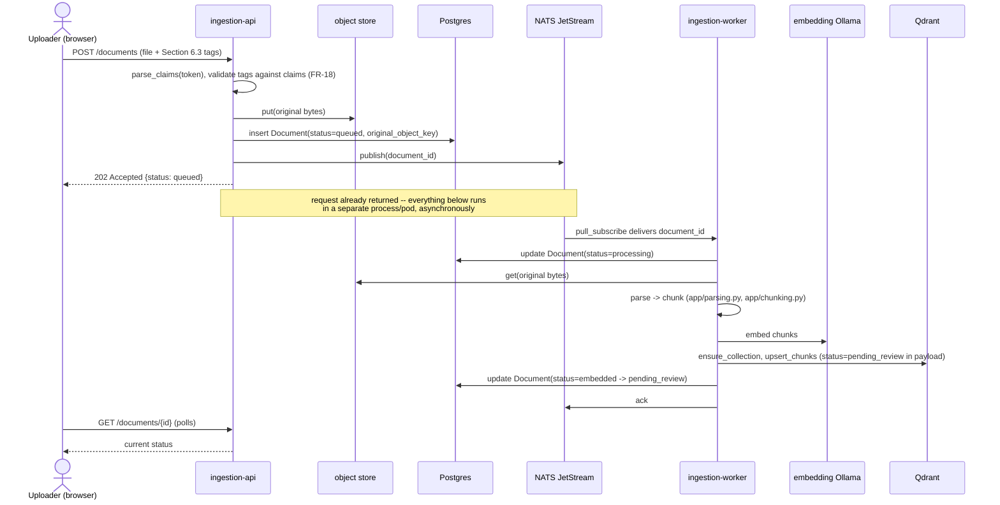
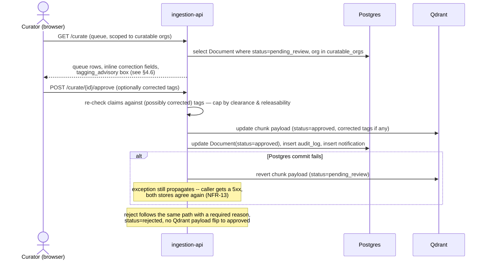
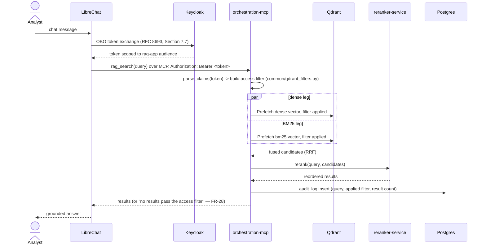
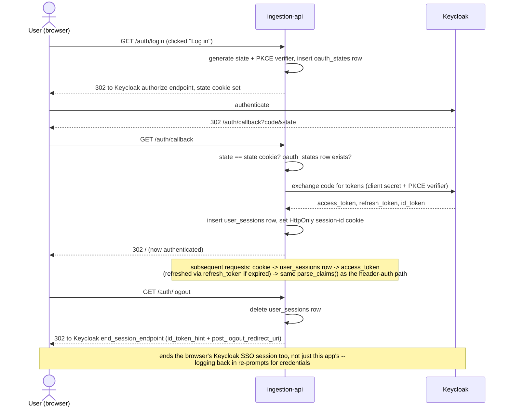
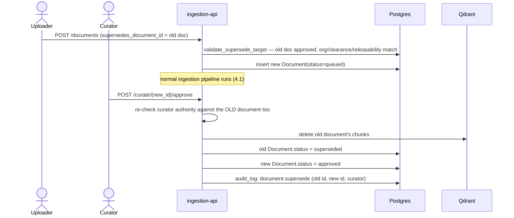
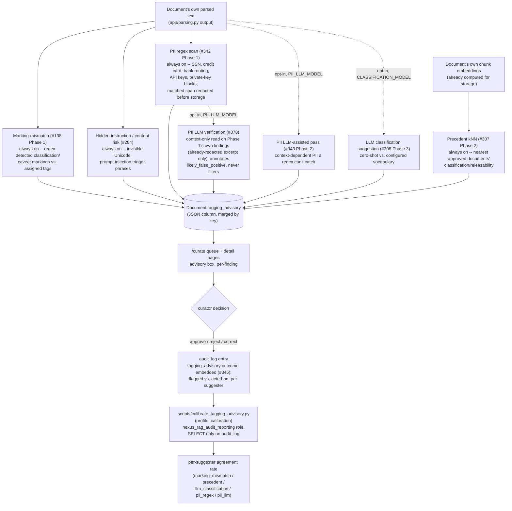
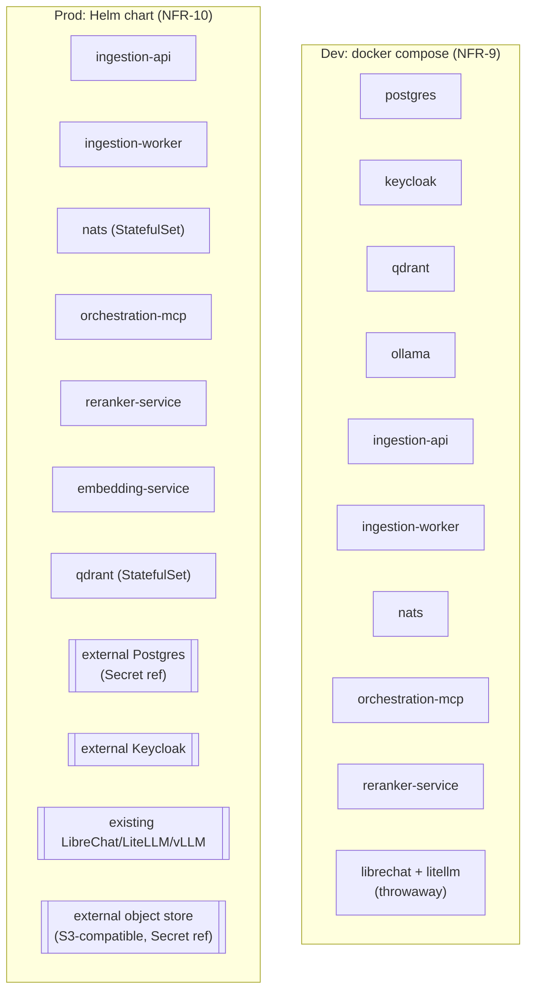

# Architecture

A visual companion to [REQUIREMENTS.md](REQUIREMENTS.md) — this document shows how the
pieces fit together and how data moves through them. For rendered Mermaid diagrams of
the full system — every running application, the ingestion and retrieval pipelines, the
classification/tagging model, the document lifecycle, and the Helm topology — see
[docs/architecture/diagrams.md](docs/architecture/diagrams.md) (issue #129). It describes what's actually built
(see `docs/dev-setup.md`'s "What's stubbed vs working" for the authoritative, current
list) plus one flow that's designed but not yet implemented, called out explicitly where
it appears.

## 1. System overview

```mermaid
flowchart LR
    subgraph existing["Existing MPNexus (not built by this project)"]
        LibreChat["LibreChat<br/>(chat UI)"]
        LiteLLM["LiteLLM<br/>(gateway)"]
        VLLM["vLLM/Ollama<br/>(generation)"]
        Keycloak["Keycloak<br/>(OIDC IdP)"]
    end

    subgraph new["Built by this project"]
        IngestUI["ingestion-api<br/>(upload + curation UI/API)"]
        Worker["ingestion-worker<br/>(durable parse/chunk/embed/store)"]
        NATS[("NATS JetStream<br/>(durable job queue)")]
        ObjStore[("object store<br/>(original files)")]
        MCP["orchestration-mcp<br/>(rag_search MCP tool)"]
        Reranker["reranker-service"]
        EmbedOllama["embedding Ollama<br/>(dedicated instance)"]
        Qdrant[("Qdrant<br/>(vectors)")]
        Postgres[("Postgres<br/>(documents, audit, lists)")]
    end

    User(("Uploader / Curator")) -->|OIDC login| IngestUI
    Analyst(("Analyst")) --> LibreChat
    LibreChat -->|OBO-exchanged JWT| MCP
    LibreChat --> LiteLLM --> VLLM
    IngestUI -->|validate token| Keycloak
    MCP -->|validate token| Keycloak
    IngestUI --> ObjStore
    IngestUI -->|publish job| NATS
    IngestUI --> Postgres
    IngestUI --> Qdrant
    NATS -->|durable consume| Worker
    Worker --> ObjStore
    Worker --> EmbedOllama
    Worker --> Qdrant
    Worker --> Postgres
    MCP --> Qdrant
    MCP --> Reranker
    MCP --> EmbedOllama
    MCP --> Postgres
```

Everything in the `new` box is what this repo adds; everything in `existing` is assumed
already deployed and managed separately (NFR-10). The dev Compose stack (NFR-9) stands up
throwaway copies of the `existing` box too, so the whole diagram runs on a laptop.

## 2. Component inventory

| Component | Built here? | Tech | Role |
|---|---|---|---|
| `ingestion-api` | Yes | FastAPI + Jinja2/HTMX | Upload, mandatory tagging, curation queue, admin lists, notifications — both the browser UI and its REST API. Validates and durably stages a submission (Postgres row + object-store write), then publishes a job rather than processing it itself |
| `ingestion-worker` | Yes | FastAPI (health-check only) + a NATS JetStream pull consumer | Durable parse/chunk/embed/store pipeline (FR-3..FR-6), moved out of `ingestion-api`'s request path (NFR-11) |
| `orchestration-mcp` | Yes | MCPServer (Python MCP SDK 2.x, #288) | Exposes `rag_search` to LibreChat; builds the claims-based Qdrant filter, runs hybrid retrieval + rerank |
| `reranker-service` | Yes | FastAPI + sentence-transformers `CrossEncoder` | Scores/reorders fused retrieval candidates |
| `common` | Yes | Python package | Shared claims parsing, metadata schema, Qdrant filter builder, DB models, object-store abstraction (NFR-12), NATS job-queue helpers (NFR-11) — the single source of truth every service imports rather than reimplements |
| NATS JetStream | Config only | NATS | Durable, token-authenticated ingestion job queue between `ingestion-api` and `ingestion-worker` (NFR-11) |
| object store | Config only | Filesystem (dev) / any S3-compatible endpoint (prod) | Durable storage for original uploaded files, independent of Qdrant/Postgres (NFR-12) |
| embedding Ollama | Config only | Ollama | Dedicated embedding-serving instance (NFR-8: separate GPU allocation from generation) |
| Qdrant | Config only | Qdrant | Vector store — dense + BM25 named vectors per chunk, access-control payload fields, one collection per Classification level (#229) |
| Postgres | Config only | Postgres | System of record: document status, audit log, notifications, admin-configurable classification/releasability lists |
| Keycloak | External | Keycloak | OIDC IdP — realm/users/roles seeded for dev, external in prod |
| LibreChat / LiteLLM / generation vLLM/Ollama | External | — | Existing MPNexus chat + generation stack this project layers onto |

## 3. Data model

```mermaid
erDiagram
    documents ||--o{ audit_log : "target_id"
    documents ||--o{ notifications : "document_id"
    documents |o--o| documents : "supersedes_document_id"

    documents {
        uuid id PK
        string uploader_sub
        string owner_org
        string classification
        string releasability
        json access_scope
        string status "queued|processing|embedded|pending_review|approved|rejected|superseded|failed"
        uuid supersedes_document_id FK
        string original_object_key "NFR-12: key into the object store, set at submission time"
    }
    audit_log {
        uuid id PK
        string actor_sub
        string action
        string target_id
        json detail
    }
    notifications {
        uuid id PK
        string recipient_sub
        uuid document_id FK
        string decision
        bool read
    }
    classification_levels {
        int id PK
        string value
        int rank
        bool active
    }
    releasability_values {
        int id PK
        string value
        bool active
    }
```

Postgres is the transactional system of record (status, audit, admin lists). Qdrant holds
the actual chunk vectors — one point per chunk, two named vectors (`dense`, `bm25`) — plus
a copy of the access-control fields (`status`, `classification`, `releasability`,
`access_scope`) as payload, so retrieval can filter without a round trip to Postgres. The
object store (NFR-12) holds the original uploaded bytes, keyed by `original_object_key` on
the `documents` row — independent of both, so the source file survives regardless of what
happens to either the vector or metadata copy.

**Issue #229: one Qdrant collection per Classification level, not one collection for the
whole corpus.** `common/qdrant_store.py` derives a collection name from each admin-configured
Classification value (created on demand, so the code makes no assumption about a fixed set of
levels — C9) and every read/write path is scoped to it. This is defence in depth on top of
FR-26's mandatory claims-derived filter, which stays exactly as it was and still applies
inside every per-collection query — per-collection separation bounds a store-level reader (or
a retrieval path that forgot the filter) to one compartment; it does not replace the filter.
Retrieval fans out over one collection per classification the caller is cleared for and fuses
the per-collection results by rank (Reciprocal Rank Fusion, `common/vector_store.fuse_ranked`)
rather than by score, because each collection's BM25 IDF is computed server-side from that
collection's own — now classification-skewed — document statistics, so scores from different
collections are not comparable. A curator's classification correction moves a document's
chunks from one collection to another (`qdrant_store._migrate_document_classification`)
instead of writing the correction in place. The Milvus backend (#160) does not implement this
split — see `common/milvus_store.py`'s module docstring for the explicit, recorded reason —
so a `VECTOR_BACKEND=milvus` deployment keeps the single-collection FR-26 filter as its only
separation, same as Qdrant before #229.

## 4. Major flows

### 4.1 Ingestion (FR-1..FR-9, durable via NFR-11/NFR-12)

```mermaid
sequenceDiagram
    actor U as Uploader (browser)
    participant I as ingestion-api
    participant OS as object store
    participant PG as Postgres
    participant N as NATS JetStream
    participant W as ingestion-worker
    participant O as embedding Ollama
    participant Q as Qdrant

    U->>I: POST /documents (file + Section 6.3 tags)
    I->>I: parse_claims(token), validate tags against claims (FR-18)
    I->>OS: put(original bytes)
    I->>PG: insert Document(status=queued, original_object_key)
    I->>N: publish(document_id)
    I-->>U: 202 Accepted {status: queued}
    Note over I,N: request already returned -- everything below runs<br/>in a separate process/pod, asynchronously
    N->>W: pull_subscribe delivers document_id
    W->>PG: update Document(status=processing)
    W->>OS: get(original bytes)
    W->>W: parse -> chunk (app/parsing.py, app/chunking.py)
    W->>O: embed chunks
    W->>Q: ensure_collection, upsert_chunks (status=pending_review in payload)
    W->>PG: update Document(status=embedded -> pending_review)
    W->>N: ack
    U->>I: GET /documents/{id} (polls)
    I-->>U: current status
```

Implementation notes:
- **Why a queue, not `BackgroundTasks`:** the previous in-process design lost queued/
  in-flight documents on a process restart or crash mid-processing — nothing recorded
  that work needed to happen again. JetStream's ack/redelivery semantics fix that: `W`
  only acks the message on a terminal outcome. A success or a *permanent* failure
  (`ParsingError`/`EmbeddingError` — corrupt/unsupported input, an embedding request the
  service rejects outright) lands the document in `failed` and acks, since retrying the
  identical input wouldn't help. An *unexpected/transient* error (Qdrant or Postgres
  unreachable, a bug) is deliberately left un-acked, so JetStream redelivers the message
  to another attempt (this worker's next poll, or a different replica) after its
  `ack_wait` timeout — see `services/ingestion-worker/app/processing.py`.
- **Why a separate object store, not just the request's in-memory bytes:** before NFR-12,
  the original file only existed in memory/`/tmp` for the lifetime of a single
  `BackgroundTask` — nothing to hand off to a separate worker process, and nothing left
  if that process died before finishing. `common/object_store.py`'s `ObjectStore`
  abstraction (filesystem in dev, S3-compatible in prod) durably persists the bytes
  *before* the 202 response returns, keyed by `document_object_key(document_id)`; `W`
  reads it back independently rather than receiving it as an argument.
- **Qdrant credentials:** `ingestion-worker` now holds the full read/write Qdrant key
  (it's the one that calls `ensure_collection`/`upsert_chunks`); `ingestion-api` keeps
  its own full key too, since curation (§4.2) still updates/deletes points directly.
- **Batch submission (FR-34, issue #356):** `POST /documents/batch` accepts N files
  sharing one Classification/Releasability/Access-scope/Source-Originator/Doc-type
  payload, validated against the caller's claims (FR-18) exactly once rather than per
  file. Each file then runs the identical sequence above independently (its own object-
  store write, its own `Document` row, its own JetStream publish, its own curator
  review) through the same `_ingest_one_file` helper `POST /documents` uses, so the two
  paths can't drift on what "submitted" means. A per-file failure — bad type, empty,
  over the per-file size limit, or an infra-level error (object store, DB) — is reported
  against that file only and does not fail the rest of the batch; files already
  committed before the failure keep their result in the response. Supersession
  (`supersedes_document_id`) stays on the single-file endpoint, since it's inherently
  one document replacing one other. The endpoint's own aggregate request body (every
  file in one multipart request) is bounded by `MAX_UPLOAD_BYTES x MAX_BATCH_FILES`, not
  `MAX_UPLOAD_BYTES` alone — see the ingress `proxy-body-size` note in
  `helm/nexus-rag/values.yaml` and the tmpfs note in `docs/dev-setup.md`.

### 4.2 Curation (FR-10..FR-16)

```mermaid
sequenceDiagram
    actor C as Curator (browser)
    participant I as ingestion-api
    participant PG as Postgres
    participant Q as Qdrant

    C->>I: GET /curate (queue, scoped to curatable orgs)
    I->>PG: select Document where status=pending_review, org in curatable_orgs
    I-->>C: queue rows, inline correction fields,<br/>tagging_advisory box (see §4.6)
    C->>I: POST /curate/{id}/approve (optionally corrected tags)
    I->>I: re-check claims against (possibly corrected) tags — cap by clearance & releasability
    I->>Q: update chunk payload (status=approved, corrected tags if any)
    I->>PG: update Document(status=approved), insert audit_log, insert notification
    alt Postgres commit fails
        I->>Q: revert chunk payload (status=pending_review)
        Note over I: exception still propagates -- caller gets a 5xx,<br/>both stores agree again (NFR-13)
    end
    Note over I: reject follows the same path with a required reason,<br/>status=rejected, no Qdrant payload flip to approved
```

**NFR-13 (safe supersession under partial failure):** validation (curator authority,
supersede-chain checks — see §4.5) already runs before *any* mutation, Qdrant or Postgres.
Given that, the Qdrant write happens before the Postgres commit rather than after: if
`session.commit()` came first, a curator could never retry a failed sync through the same
API call, since `_load_pending` only accepts a document still in `pending_review`, and
Postgres would already say `approved`. Writing Qdrant first, then committing, keeps the
document retry-able for as long as the commit hasn't happened. The cost is the reverse
failure mode: if something *between* the Qdrant write and the commit raises (a DB error, the
old document's Qdrant chunk delete failing on a supersede), Postgres rolls back to
`pending_review`, but the Qdrant write doesn't roll back with it — leaving Qdrant already
showing `approved`/`rejected`, and therefore already affecting retrieval (FR-11/FR-26
filtering reads Qdrant's payload, not the Postgres row), while Postgres and the curation
queue both still call the document `pending_review`. `approve()`/`reject()` close that gap:
they wrap the sequence in a `try`/`except` that best-effort reverts the Qdrant write back to
`pending_review` on any failure before re-raising, so the two stores can't end up
disagreeing about a document's status.

### 4.3 Query / retrieval (FR-24..FR-29)

```mermaid
sequenceDiagram
    actor A as Analyst
    participant LC as LibreChat
    participant KC as Keycloak
    participant M as orchestration-mcp
    participant Q as Qdrant
    participant R as reranker-service
    participant PG as Postgres

    A->>LC: chat message
    LC->>KC: OBO token exchange (RFC 8693, Section 7.7)
    KC-->>LC: token scoped to rag-app audience
    LC->>M: rag_search(query) over MCP, Authorization: Bearer <token>
    M->>M: parse_claims(token) -> build access filter (common/qdrant_filters.py)
    par dense leg
        M->>Q: Prefetch dense vector, filter applied
    and BM25 leg
        M->>Q: Prefetch bm25 vector, filter applied
    end
    Q-->>M: fused candidates (RRF)
    M->>R: rerank(query, candidates)
    R-->>M: reordered results
    M->>PG: audit_log insert (query, applied filter, result count)
    M-->>LC: results (or "no results pass the access filter" — FR-28)
    LC-->>A: grounded answer
```

The access filter (`status=approved` + `classification` at-or-below clearance +
`releasability` match + `access_scope` match) is built entirely server-side from the
verified token — never from anything the client/LibreChat supplies — which is what makes
FR-26 non-bypassable.

**Issue #272:** the audited `applied_filter` reports both `collections_eligible` (every
per-classification Qdrant collection §3's collection split says the caller's clearance
*could* resolve to) and `collections_queried` (the subset `hybrid_query` actually fanned
out over, skipping any level with no `approved` documents yet). Reporting only the former,
as the audit entry did before #272, overstated what a query actually searched — the one
place that overstatement is dangerous, since FR-31 audit evidence is what an operator
reconstructs a retrieval decision from after the fact.

`orchestration-mcp` also exposes this same logic as a plain REST endpoint,
`POST /debug/rag_search`, for curl-based testing without an MCP client (§4.4's ingestion
UI has a `/search` page that's a thin proxy over this same endpoint, forwarding the
logged-in user's own session token — no enforcement logic duplicated in `ingestion-api`,
it's still all in `orchestration-mcp`).

**Prompt-injection mitigation (P1):** retrieved chunk `text` is untrusted by construction —
it's whatever an uploader submitted, and FR-18's tagging validation constrains metadata, not
document content. `run_rag_search()` (`app/rag_search.py`) delimits every result's `text`
with an explicit `<untrusted_document_content>` marker (applied *after* reranking, so
`reranker-service`'s cross-encoder still scores the raw text) and adds a `security_notice`
field to the response instructing the calling model to treat delimited content as reference
material to cite, not instructions to follow — the same marker-plus-notice pattern also
carried in the tool's own MCP docstring, so it doesn't depend on one particular client
surfacing docstrings to its model. This is a mitigation, not a guarantee (§7).

### 4.4 Ingestion UI login

Replaces the old pasted-access-token dev workaround. Every underlying fetch call (upload,
curate, notifications) rides a session cookie instead of a manually-attached header. The
top nav shows the current user's `preferred_username` plus "Log out" when logged in; it
doesn't render at all when logged out (see #246 below) — every link on it would just bounce
an anonymous visitor back to the login page anyway.

**Issue #246: the whole app is gated behind a login landing page.** Every page route
(`GET /`, `/curate`, `/admin`, `/notifications`, `/search`) checks `get_current_user_optional`
first and renders `login.html` in place of its real content for an anonymous visitor —
same URL, `200 OK`, no redirect loop — rather than rendering the full page and letting the
visitor discover they can't do anything on the first action they take. `login.html` is a
centered logo/application name/login button, nothing else — the top nav (`base.html`'s
`<header>`) is skipped entirely for an anonymous visitor, since none of its links lead
anywhere they can reach yet. This is authentication only: `/admin`'s page still renders for
any signed-in user regardless of role, exactly as before — role-based authorization stays
on the `/admin/*` action endpoints (`require_admin`), not on the page route. Per-page role
gating (e.g. hiding `/curate` from a non-curator) is tracked as a separate, later issue.

**Issue #248: branding and a mandatory-acceptance login banner**, both admin-configurable
via `/admin/branding` and `/admin/login-banner` (`PortalSettings`, same single-row,
deployment-wide shape as the classification banner/theme settings above). Application name
and logo apply everywhere, not just the login page — header, tab title, and favicon — since
they're a deployment property like the classification banner, not a login-page-only
concern. The login popup is mandatory by construction rather than by convention: the login
button is server-rendered `hidden` whenever an active popup is configured, and only the
client-side Accept handler reveals it, so there's no path to `/auth/login` that skips it.
Decline navigates to `/login/declined` instead.

```mermaid
sequenceDiagram
    actor U as User (browser)
    participant I as ingestion-api
    participant KC as Keycloak

    U->>I: GET /auth/login (clicked "Log in")
    I->>I: generate state + PKCE verifier, insert oauth_states row
    I-->>U: 302 to Keycloak authorize endpoint, state cookie set
    U->>KC: authenticate
    KC-->>U: 302 /auth/callback?code&state
    U->>I: GET /auth/callback
    I->>I: state == state cookie? oauth_states row exists?
    I->>KC: exchange code for tokens (client secret + PKCE verifier)
    KC-->>I: access_token, refresh_token, id_token
    I->>I: insert user_sessions row, set HttpOnly session-id cookie
    I-->>U: 302 / (now authenticated)
    Note over I: subsequent requests: cookie -> user_sessions row -> access_token<br/>(refreshed via refresh_token if expired) -> same parse_claims() as the header-auth path
    U->>I: GET /auth/logout
    I->>I: delete user_sessions row
    I-->>U: 302 to Keycloak end_session_endpoint (id_token_hint + post_logout_redirect_uri)
    Note over U,KC: ends the browser's Keycloak SSO session too, not just this app's --<br/>logging back in re-prompts for credentials
```

Implementation notes:
- `rag-app` is already a confidential client with a secret in the realm export, so no new
  Keycloak config was needed — `app/routes/auth.py` and `app/deps.py`.
- Tokens live in a new Postgres `user_sessions` table (`common/models.py`), not in the
  cookie itself — keeps the token out of JS-reachable storage and makes a session
  individually revocable. `oauth_states` is a matching short-lived table for the
  login-in-progress `state`/PKCE `code_verifier` pair.
- The existing header-based `get_current_user` path is untouched for API/MCP callers;
  it now checks the session cookie first and falls back to the Authorization header — no
  forked enforcement logic between browser and API callers. `get_current_user_optional`
  (used only by the three page routes, for the nav's username display) is the same
  resolution but returns `None` instead of raising on an anonymous visitor.
- The paste-a-token box was retired outright (not kept behind a flag) rather than running
  two parallel auth UX paths.
- Logout uses `id_token_hint` (the `id_token` captured at `/callback`) rather than just
  `client_id`, since newer Keycloak versions reject the latter for RP-initiated logout.
- Helm chart wiring: `externalKeycloak.clientId`/`.clientSecret` (Secret-backed, same
  pattern as `externalPostgres`) and `ingestionApi.oidcRedirectUri` (derived from
  `ingress.host`/`ingress.tls` if not set explicitly, via `_helpers.tpl`'s
  `nexus-rag.oidcRedirectUri` — fails the render rather than deploying a broken callback
  URL if neither is available) / `.cookieSecure`. Like the rest of the chart, unverified by
  `helm lint`/`helm template` — see `docs/dev-setup.md`'s "Stubbed / TODO" list.
- CSRF protection (NFR-14): a second, non-`HttpOnly` cookie (`nexus_rag_csrf`) set
  alongside the session cookie — the session cookie alone would ride along on a forged
  cross-site request, but only this app's own JS can read the CSRF cookie's value to echo
  it back as a header, which a cross-site attacker can't. `deps.verify_csrf` checks
  cookie == header on every state-changing route, and is a no-op for bearer-token callers
  (no session cookie means nothing CSRF can forge in the first place).

### 4.5 Re-ingestion / versioning (FR-7)

```mermaid
sequenceDiagram
    actor U as Uploader
    actor C as Curator
    participant I as ingestion-api
    participant PG as Postgres
    participant Q as Qdrant

    U->>I: POST /documents (supersedes_document_id = old doc)
    I->>PG: validate_supersede_target — old doc approved, org/clearance/releasability match
    I->>PG: insert new Document(status=queued)
    Note over I: normal ingestion pipeline runs (4.1)
    C->>I: POST /curate/{new_id}/approve
    I->>I: re-check curator authority against the OLD document too
    I->>Q: delete old document's chunks
    I->>PG: old Document.status = superseded
    I->>PG: new Document.status = approved
    I->>PG: audit_log: document.supersede (old id, new id, curator)
```

Ordering matters here (NFR-13): the *new* document's Qdrant chunks are flipped to
`approved` — see §4.2's diagram — *before* the old document's chunks are deleted, and
`_validate_supersede` re-checks the whole chain (old document still `approved`, curator's
authority over the old document specifically, not just the new one) before any of this
runs. That's what guarantees there's never a window where neither version is retrievable:
worst case, both are briefly retrievable at once, which REQUIREMENTS.md's NFR-13 calls out
as the acceptable, preferable outcome over the alternative.

### 4.6 Tagging advisory pipeline (issue #138 family)

Curation (§4.2) is a human decision, but the human doesn't decide blind: `ingestion-worker`
runs a family of advisory suggesters against a document's own parsed text and its own
computed embeddings while it's still `processing`, folding every finding into one JSON
column, `Document.tagging_advisory`, that `/curate`'s queue page renders as an advisory box
next to the approve/reject controls. Every suggester shares the same posture — advisory
only (never mutates a tag, never blocks, never delays ingestion), fail-safe (any error,
including an unreachable model or vector store, is swallowed and logged, leaving whatever
`tagging_advisory` already held) — because FR-11's spillage control stays the curator's
call, not a signal's.

```mermaid
flowchart TD
    text["Document's own parsed text<br/>(app/parsing.py output)"]
    vec["Document's own chunk embeddings<br/>(already computed for storage)"]

    text --> s1["Marking-mismatch (#138 Phase 1)<br/>always on -- regex-detected classification/<br/>caveat markings vs. assigned tags"]
    text --> s2["Hidden-instruction / content risk (#284)<br/>always on -- invisible Unicode,<br/>prompt-injection trigger phrases"]
    text --> s3["PII regex scan (#342 Phase 1)<br/>always on -- SSN, credit card, bank routing,<br/>API keys, private-key blocks;<br/>matched span redacted before storage"]
    s3 -.->|opt-in, PII_LLM_MODEL| s3v["PII LLM verification (#378)<br/>context-only read on Phase 1's own findings<br/>(already-redacted excerpt only); annotates<br/>likely_false_positive, never filters"]
    text -.->|opt-in, PII_LLM_MODEL| s4["PII LLM-assisted pass (#343 Phase 2)<br/>context-dependent PII a regex can't catch"]
    text -.->|opt-in, CLASSIFICATION_MODEL| s5["LLM classification suggestion (#308 Phase 3)<br/>zero-shot vs. configured vocabulary"]
    vec --> s6["Precedent kNN (#307 Phase 2)<br/>always on -- nearest approved documents'<br/>classification/releasability"]

    s1 & s2 & s3 & s3v & s4 & s5 & s6 --> col[("Document.tagging_advisory<br/>(JSON column, merged by key)")]
    col --> ui["/curate queue + detail pages<br/>advisory box, per-finding"]
    ui --> dec{"curator decision"}
    dec -->|approve / reject / correct| audit["audit_log entry<br/>tagging_advisory outcome embedded (#345):<br/>flagged vs. acted-on, per suggester"]
    audit --> calib["scripts/calibrate_tagging_advisory.py<br/>(profile: calibration)<br/>nexus_rag_audit_reporting role,<br/>SELECT-only on audit_log"]
    calib --> report["per-suggester agreement rate<br/>(marking_mismatch / precedent /<br/>llm_classification / pii_regex / pii_llm)"]
```

What to note:

- **Two enforcement-vs-advisory boundaries stay separate on purpose.** The mandatory
  claims-based checks in §5's table (what a user may tag, what a curator may approve, what
  a query may retrieve) are hard gates; everything in this section is a hint layered on top
  of, never instead of, that human curation step (FR-11/FR-12 unchanged).
- **PII findings never echo the sensitive value.** #342's regex pass records a fixed label
  naming the kind of pattern and a context excerpt with the matched span replaced by
  `[REDACTED]`; #343's LLM pass is prompted not to repeat the value either, but — unlike
  Phase 1's code-enforced redaction — that's a prompt instruction the model could ignore,
  so its `kind`/`rationale` fields are treated as untrusted (textContent-only rendering in
  `curate.html`, same as the LLM classification suggestion's `rationale`).
- **#378's verification pass has a narrower blast radius than #343's.** It never sees the
  document's raw text at all -- only the same already-redacted `context` excerpts Phase 1
  already produced and the curator already sees, so there is no new prompt-injection
  surface beyond what Phase 1's own regex pass already exposed. Its `likely_false_positive`
  verdict is additive metadata on an existing finding, not a filter: a false-positive
  verdict never removes, hides, or dims the finding it's attached to.
- **`calibrate_tagging_advisory.py` reads through a dedicated, SELECT-only-on-`audit_log`
  role** (`nexus_rag_audit_reporting`) rather than any of the four services' own
  credentials — NFR-2/NFR-3 keep every application role INSERT-only on `audit_log`, so
  reading the curation trail back out has to be its own attributable identity, not a
  services credential doing double duty.
- **Reporting only, not a gate**: a curator override is not, by itself, proof a suggester
  was wrong, so the calibration report has no CI-enforced accuracy floor by default
  (`--min-agreement` is opt-in for a deployment that wants one).
- **Confidence varies by phase** — see `docs/dev-setup.md`'s "What's stubbed vs working"
  for the current, authoritative per-issue label; several phases (#308, #343, #345) have
  been validated against a real `docker compose up` with a real Ollama call and a real
  curator decision round-trip, others remain tested against mocks only.

## 5. Security model

Single enforcement principle: every claim-gated decision — what a user may *tag* a
document with (FR-18), what a curator may *approve* (FR-14), and what a query may
*retrieve* (FR-26) — is derived from the same verified OIDC claims via `common/claims.py`,
never from client-supplied values. Two independent enforcement points share one library
rather than reimplementing the check:

| Enforcement point | Where | What it checks |
|---|---|---|
| Ingest-time tagging | `ingestion-api` upload route | Classification/Releasability offered ≤ uploader's clearance/releasability |
| Curation | `ingestion-api` curate route | Approving curator holds `rag-curate:<org>` for the doc's org, and clearance/releasability cover the (possibly corrected) tags |
| Query-time retrieval | `orchestration-mcp` | Qdrant filter restricts to `approved` + classification ≤ clearance + releasability match + access_scope match |
| Audit | Both services, `audit_log` table | Every submit/approve/reject/supersede/query is recorded against the actor's `sub`, not a self-reported name. Each row is also exported as RFC 5424 syslog to the environment's SIEM when `SIEM_SYSLOG_HOST` is configured (NFR-2, #73) -- the DB row stays the durable system of record; the syslog copy is an export, fail-open by design so a collector outage never blocks the request path |

## 6. Deployment topology

```mermaid
flowchart TB
    subgraph dev["Dev: docker compose (NFR-9)"]
        direction LR
        d1["postgres"] & d2["keycloak"] & d3["qdrant"] & d4["ollama"] & d5["ingestion-api"] & d5b["ingestion-worker"] & d5c["nats"] & d6["orchestration-mcp"] & d7["reranker-service"] & d8["librechat + litellm<br/>(throwaway)"]
    end
    subgraph prod["Prod: Helm chart (NFR-10)"]
        direction LR
        p1["ingestion-api"] & p1b["ingestion-worker"] & p1c["nats (StatefulSet)"] & p2["orchestration-mcp"] & p3["reranker-service"] & p4["embedding-service"] & p5["qdrant (StatefulSet)"]
        p6[["external Postgres<br/>(Secret ref)"]]
        p7[["external Keycloak"]]
        p8[["existing LibreChat/LiteLLM/vLLM"]]
        p9[["external object store<br/>(S3-compatible, Secret ref)"]]
    end
```

Dev stands up *everything*, including throwaway LibreChat/LiteLLM/Keycloak instances, so
the full OBO/MCP flow can be exercised locally. The Helm chart deploys only the boxes in
the `new` component table (§2) — Postgres, Keycloak, and the object store are referenced
via `values.yaml` (`externalPostgres.existingSecret`, `externalKeycloak.issuerUrl`,
`externalObjectStore.endpoint`/`.bucket`), not deployed by the chart.

## 7. Known gaps

### Observability (issue #72)

`orchestration-mcp` exposes a Prometheus `/metrics` endpoint covering the
retrieval path: per-stage latency (embed / retrieve / rerank / total), query
outcomes, result-count distribution, and the reranker fallback rate — the last
of which matters because FR-25 degrades to fused order instead of failing, so
a ranking-quality drop is otherwise invisible. Per-request timings also land in
the FR-31 audit entry, next to the actor and the authorization outcome.

Deliberately *not* returned to callers: response latency correlates with how
much the access filter matched and how many candidates were reranked, so
per-stage figures would sharpen the membership-inference surface #127
describes. Operators get them via the audit log and the scrape endpoint.

Closed since this section was written (#133): `ingestion-api` (:8001),
`ingestion-worker` (:8004), and `reranker-service` (:8003) all expose `/metrics`
too, so ingestion throughput, queue depth, and worker processing duration are
measured. The full stack that consumes them — Prometheus, Loki, Tempo,
Alertmanager, 13 Grafana dashboards, 10 alert rules — ships as a Compose profile
(`docs/dev-setup.md`) and, for clusters with no monitoring stack of their own, as
the separately-installed `helm/observability` chart (#257, `docs/observability.md`).
Pyroscope also ships in the Compose profile; all four services push it
continuous CPU profiles once `PYROSCOPE_SERVER_ADDRESS` is set (#349),
correlated to Tempo traces via the shared `service.name`/`service_name`
convention.

Still open: NFR-4's end-to-end latency budget remains an open question in
REQUIREMENTS.md, so the retrieval alert rule's 5 s p95 threshold is a provisional
stand-in rather than an agreed target — the instrumentation to answer it with data
now exists, the number to compare against does not. Continuous profiling (#349)
sharpens "which stage" beyond what per-stage span durations already show, but
is not needed to answer NFR-4 itself.

See `docs/dev-setup.md`'s "What's stubbed vs working" for the current, authoritative list
(kept there rather than duplicated here, since it changes as work lands). §4.1's NATS-based
durable ingestion pipeline (`ingestion-worker`, NFR-11) — the largest structural change in
the P0 hardening batch — has since been **validated against a real `docker compose up`**:
a document submitted through `ingestion-api` was durably queued, picked up and processed by
`ingestion-worker` (`queued → processing → pending_review`), curated and approved, and
found by a real claims-filtered query against `orchestration-mcp`. That run also surfaced a
real bug this sandbox's mocked verification couldn't have caught (a missing `mkdir` before
the non-root `chown` in `ingestion-api`/`ingestion-worker`'s Dockerfiles left the
object-store mount unwritable) — fixed, see `docs/dev-setup.md`.

**LibreChat's own OIDC login now works, confirmed live end to end (issue #75)**, after fixing
`librechat.yaml`'s `mcpServers` schema (`obo.scopes` needs a space-delimited string, not a
JSON array), `ALLOW_SOCIAL_LOGIN` (off by default), `JWT_SECRET`/`JWT_REFRESH_SECRET`/
`CREDS_KEY`/`CREDS_IV` (all required at LibreChat boot, unrelated to Keycloak), an MCP
SSRF domain-allowlist blocking `orchestration-mcp`, a `depends_on`/Keycloak-healthcheck
race, a missing `OPENID_SCOPE` (LibreChat's `configureOpenId()` silently never runs without
it), and finally the real root cause: `openid-client` refuses a plain-HTTP `OPENID_ISSUER`
outright. Keycloak now has a real (self-signed, dev-only) HTTPS listener, fronted alongside
a small nginx proxy for LibreChat itself (which has no HTTPS listener of its own) — verified
with a scripted login (real Keycloak password submit, full redirect chain, real LibreChat
session cookie), not just log inspection.

The OBO token-exchange mechanism (§4.4) is also now confirmed live — and needed no Keycloak
admin-console permission step at all, contrary to what this section previously said: that
requirement only applies to the deprecated *legacy* token exchange. Standard Token Exchange
V2 (RFC 8693, what `standard.token.exchange.enabled` actually configures) needs no
fine-grained permission. The real, previously-undiagnosed bug was that switch sitting on
`rag-app` (the exchange's target) instead of `librechat` (the requester) — plus a second bug,
the exchanged token's HTTPS issuer wasn't in `orchestration-mcp`/`ingestion-api`'s
`OIDC_ISSUERS` allowlist. Both fixed; a scripted token exchange now returns a correctly
claims-filtered `rag_search` result end to end.

Still open: LibreChat's *own* code performing that exchange when a real chat message
triggers the tool. Driving that specific path hit a separate, genuine LibreChat bug — its
`openidJwt` reused-token strategy rejects its own freshly-issued token with "invalid
algorithm" — tracked as a follow-up rather than chased down inline. Because of that, §4.3's
`rag_search` is confirmed two ways (the REST debug endpoint, and now a direct OBO exchange
replicating exactly what LibreChat's backend should do) but still not through LibreChat's
actual MCP wire connection, so §4.3's prompt-injection mitigation (no regression test that a
real generation model actually respects the delimiter/notice) remains unconfirmed against
the real LibreChat path specifically.
