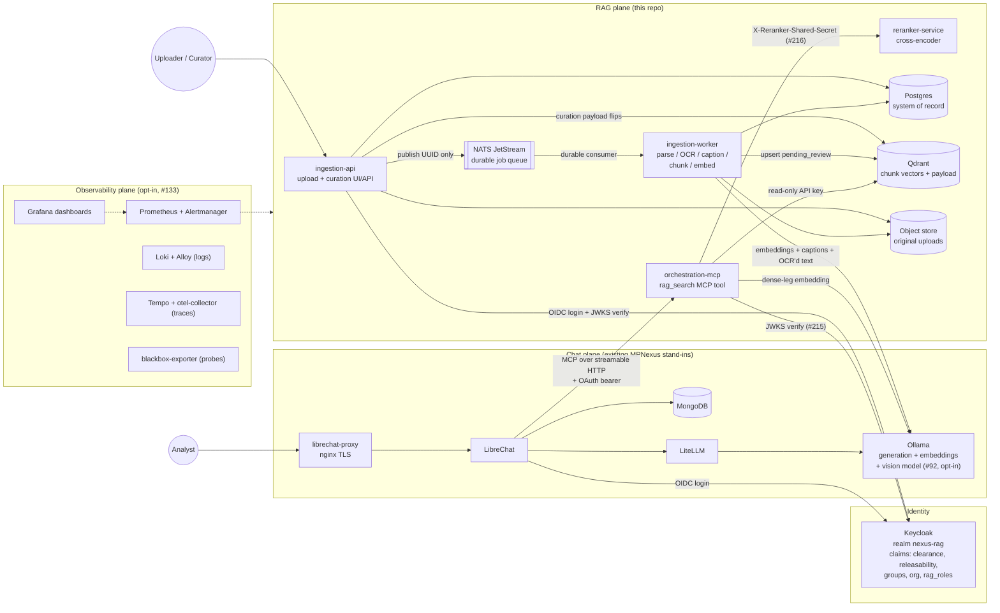
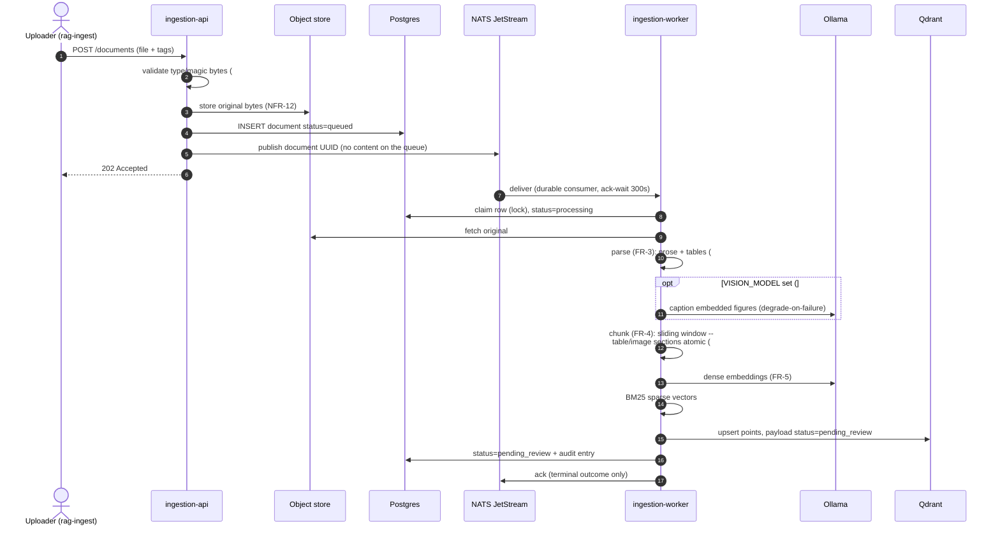
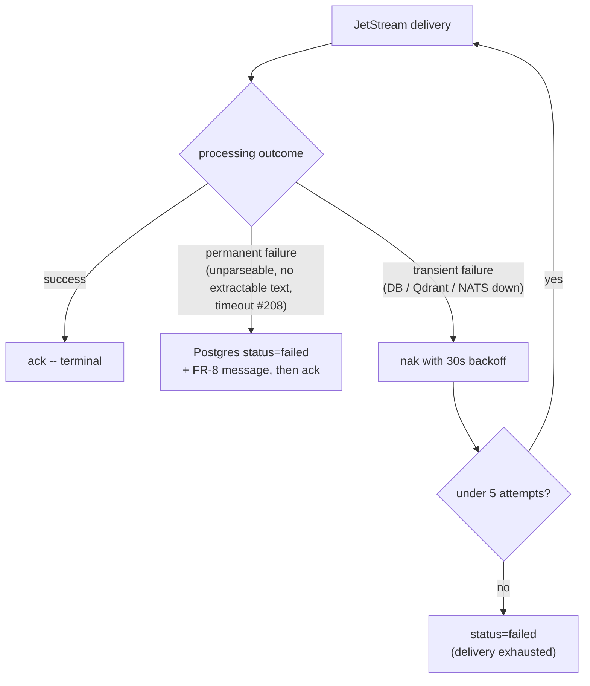
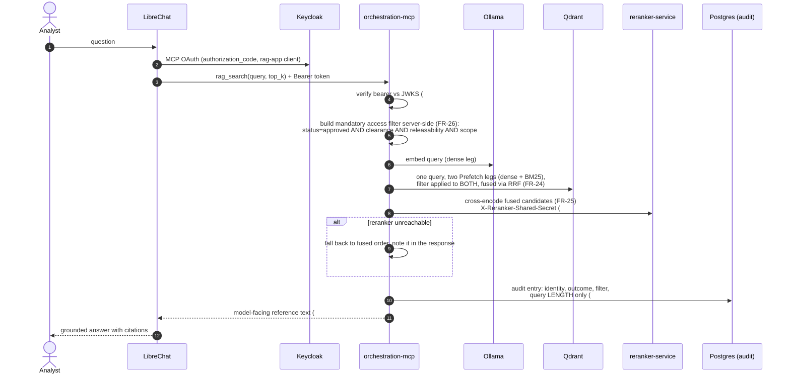
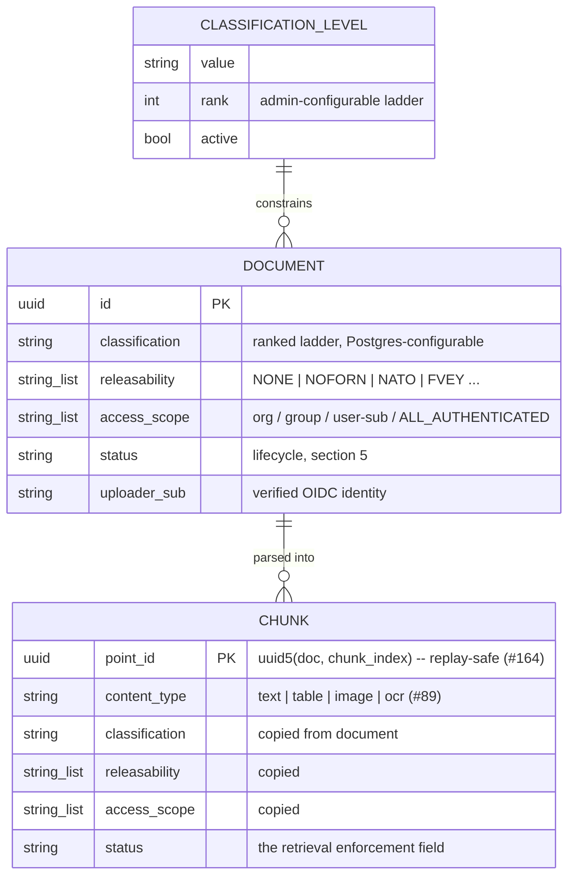
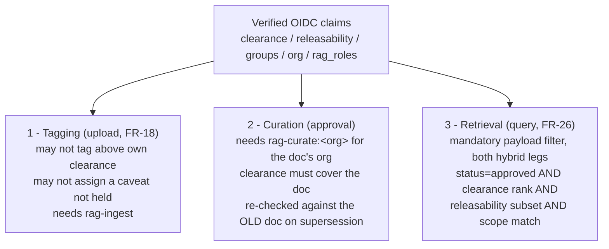
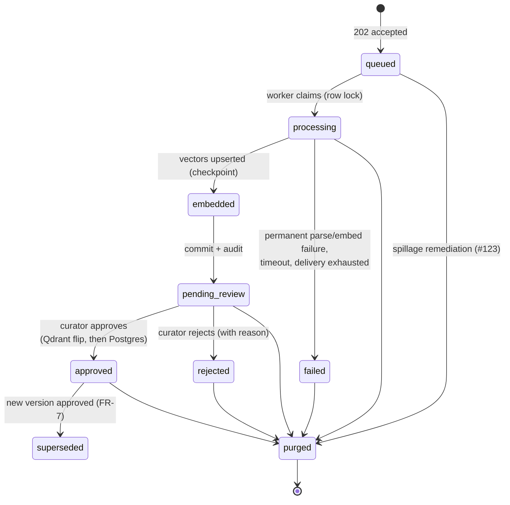
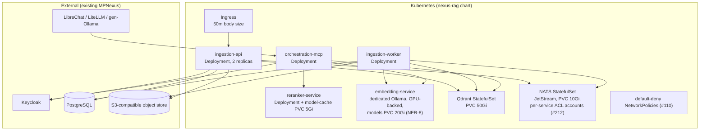

# Architecture diagrams

Visual reference for the full system (issue #129): every running application,
the ingestion data pipeline, the query/retrieval pipeline, the
classification/tagging model, the document lifecycle, and the production
(Helm) topology. All diagrams are Mermaid, derived from the code
(`docker-compose.yml`, `services/*`, `infra/*`, `helm/nexus-rag`) — when a
diagram and the code disagree, the code wins and the diagram has a bug; please
file it.

Feature references: table extraction (#88), content-type tagging (#89),
image captioning (#92), OCR (#241), and the durable queue hand-off (#164)
are drawn as they exist on their branches/PRs at the time of writing — the
per-feature issue numbers in node labels are the pointer to their exact
status.

`ARCHITECTURE.md` remains the prose source of truth; this page is the visual
companion.

---

## 1. System context — all applications

The stack splits into the **existing chat plane** (LibreChat, LiteLLM,
Ollama, MongoDB — throwaway dev stand-ins for what MPNexus already runs), the
**new RAG plane** this repo adds (four custom Python services plus Postgres,
Qdrant, NATS, and the object store), the **identity plane** (Keycloak), and
an **opt-in observability plane** (`--profile observability`, issue #133).

What to note:

- Every claim-gated decision goes through one shared library
  (`services/common/common/claims.py`), verified against Keycloak's JWKS, at
  **three enforcement points**: tagging (upload), curation (approval), and
  retrieval (query filter).
- `orchestration-mcp` holds a **read-only** Qdrant API key (NFR-15); only
  `ingestion-api` (curation flips) and the worker (upserts) can write vectors.
- The audit log is append-only from the app role's perspective — the
  `lock-down-db-grants` one-shot leaves every application role with INSERT and
  nothing else -- not even SELECT (NFR-2, #278).
- NATS uses per-service credentials with subject-level ACLs (#212):
  `ingestion-api` may only publish, the worker may only consume.
- One-shot containers (`ollama-model-init`, `seed-sample-data`,
  `ensure-db-roles`, `provision-metrics-view`, `lock-down-db-grants`,
  `eval-retrieval` under `--profile eval`) run to completion and exit; they
  are omitted above for legibility.

---

## 2. Ingestion data pipeline

From file upload to searchable, approved chunks. The 202 is returned only
after the Postgres row, the object-store write, and the queue publish have
all succeeded (NFR-11/NFR-12) — from that point the pipeline is durable.

Failure semantics:

What to note:

- Chunks enter Qdrant as `pending_review` and are **invisible to retrieval**
  until a curator approves; approval flips the Qdrant payload *before* the
  Postgres commit, with a best-effort revert if the commit fails (NFR-13).
- Messages carry only the document UUID — no content transits the queue.
- Captioning (#92) and the scanned-page OCR fallback (#241) degrade rather
  than fail: a down vision model or missing tesseract costs captions/OCR
  text, never the document. An *image upload* with no readable text is the
  exception — OCR is that format's only content path, so it fails with an
  actionable message.
- Superseding a document (FR-7): on approval of the new version, the new
  chunks flip to `approved` *before* the old version's chunks are deleted —
  never a window where neither version is retrievable.

---

## 3. Query / retrieval pipeline

From an analyst's chat message to grounded, access-controlled references.

What to note:

- The access filter is built **server-side from verified claims**, never
  client input, and is injected into *both* hybrid legs — neither the dense
  nor the BM25 path can bypass it (the core FR-26 invariant).
- Hybrid retrieval is Qdrant-native: two Prefetch legs fused with Reciprocal
  Rank Fusion, then a cross-encoder rerank over the fused pool.
- Privacy posture: the audit log stores query *length*, not query text
  (#125); similarity scores are never returned to callers
  (membership-inference mitigation); "no results passed the access filter"
  is a valid, explicit answer (FR-28).
- Machine-derived passages carry a `Provenance:` line so the model presents
  OCR'd text as "the scanned copy reads…" and figure captions as
  descriptions, not verbatim quotes (#241, pre-wired for #92).
- The same logic is exposed as `POST /debug/rag_search` for curl-based
  testing; it returns the full structured diagnostic object instead of the
  model-facing text.

---

## 4. Data classification and tagging model

Every document — and every chunk derived from it — carries a mandatory tag
set. Every tag is constrained by the **uploader's** verified claims at
ingest, re-checked against the **curator's** claims at approval, and matched
against the **query user's** claims at retrieval, all through the same
`services/common` helpers.

### 4.1 Tag schema and controlled vocabularies

What to note:

- `NONE` is an explicit, first-class releasability value (not NULL) meaning
  "no caveat" — anyone may assign it and everyone can see it, unlike
  `NOFORN`/`NATO`/`FVEY`, which gate on the caller's coalition claims.
- `ALL_AUTHENTICATED` waives only org/group/user scoping; it is deliberately
  **not** named PUBLIC — classification and releasability still apply.
- Classification levels are a **ranked list in Postgres**, not hardcoded —
  admins can extend/re-order the ladder and ingest + retrieval both pick it
  up via `common/classification.py`.
- Chunk payloads carry a copy of the access fields so retrieval filters
  inside Qdrant without a per-query Postgres round trip.

### 4.2 Claims → authorization at the three enforcement points

Worked examples with the seeded dev users (`docs/dev-setup.md`):

| User | Claims | Can tag at ingest | Sees at retrieval |
|---|---|---|---|
| `alice-ingest` | clearance CUI, org USAREUR-AF | UNCLASSIFIED or CUI, releasability NONE | approved docs ≤ CUI, NONE, in her org/groups/self scope or ALL_AUTHENTICATED |
| `bob-query` | clearance SECRET, FVEY + NATO | (no rag-ingest role) | approved docs ≤ SECRET, NONE/FVEY/NATO, in scope |
| `carol-curator` | SECRET, rag-curate:USAREUR-AF | (query role only) | bob's visibility + approval authority over USAREUR-AF queue items her clearance covers |
| `dave-admin` | SECRET, both orgs, all roles | anything ≤ SECRET | widest visibility |

Key invariant: a user can never tag a document above their own clearance,
never assign a caveat they don't hold, and never retrieve a chunk whose tags
exceed their claims — the filter is server-built and injected into both
hybrid legs, so there is no client-controlled path around it.

---

## 5. Document status lifecycle

What to note:

- Retrieval eligibility comes **only** from the Qdrant payload `status` —
  Postgres is the system of record, Qdrant is the enforcement point.
- `embedded` is a checkpoint, not a terminal state: a crash between it and
  `pending_review` is replayed by JetStream redelivery, and the
  deterministic point IDs (#164) make the replayed upsert overwrite rather
  than duplicate.
- `purged` (#123) destroys content in every store — object-store original,
  Qdrant points, content-bearing Postgres fields — leaving a tombstone so
  audit entries still resolve. It requires the dedicated `rag-purge` role.

---

## 6. Production deployment (Helm)

`helm/nexus-rag` deploys **only the RAG plane** (NFR-10): LibreChat,
LiteLLM, Keycloak, generation-serving Ollama, Postgres, and the S3 object
store are assumed to exist and are configured, not installed
(`existingSecret` pattern throughout; air-gapped registry prefix via
`global.imageRegistry`).

What to note:

- The dedicated embedding Ollama is a **separate GPU allocation** from the
  cluster's generation-serving instance (NFR-8) — the chart never touches
  the chat plane's model serving.
- Optional Milvus backend (#160): `vectorBackend: milvus` renders a
  single-node Milvus StatefulSet (16Gi) in place of Qdrant — one backend per
  deployment, behind `common/vector_store.py`'s seam.
- Compose mirrors the chart's securityContext (uid 10001, read-only root,
  `cap_drop: ALL`, `no-new-privileges`, sized tmpfs) and this is enforced
  mechanically by `scripts/check_compose_hardening.py` (#111), so dev runs
  exercise the production posture.
- The worker image bakes in tesseract + eng traineddata (#241) — OCR makes
  no network call and downloads nothing at runtime (NFR-1).

---

## Known gaps (kept honest, per the repo's labeling convention)

- The Helm chart passes `helm lint` in CI (`security.yml`) but has **not
  been deployed against a real cluster** — "implemented", not "validated".
- LibreChat-driven OBO token exchange (RFC 8693) was investigated and does
  not fit two-clients-one-realm Keycloak; the shipped design uses per-user
  `authorization_code` MCP OAuth instead (see `docs/dev-setup.md`).
- `<untrusted_document_content>` markers and the Provenance line are
  prompt-injection *mitigations*, not guarantees (REQUIREMENTS.md §11).
- Encryption at rest relies on an encrypted StorageClass; PyKMIP integration
  was deferred.
- Captioning (#92) and OCR (#241) reference their issues in the diagrams;
  check those issues/PRs for merge status when reading this page at a
  distance from its last update.
