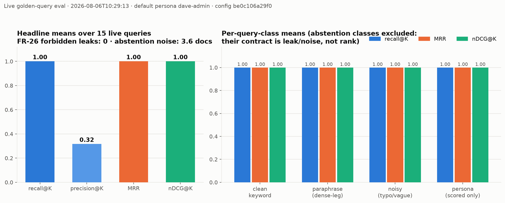
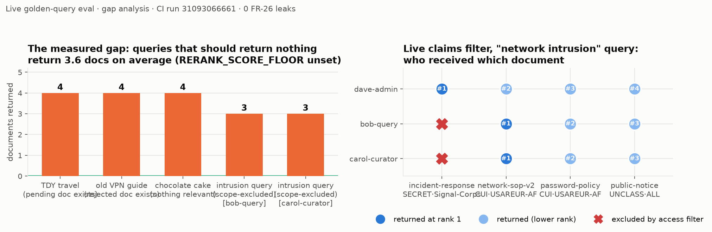
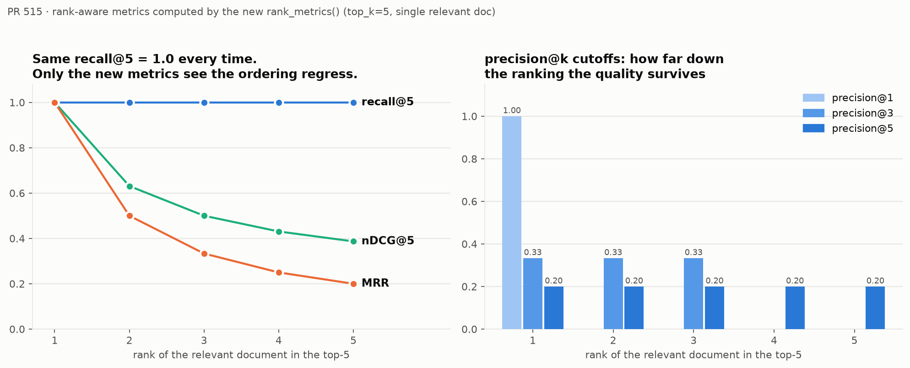
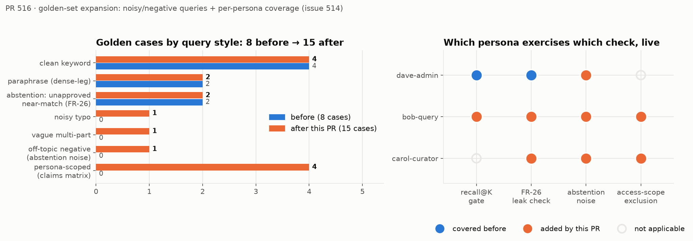
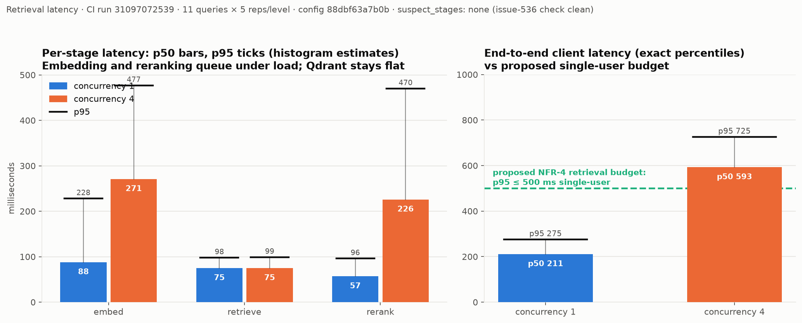
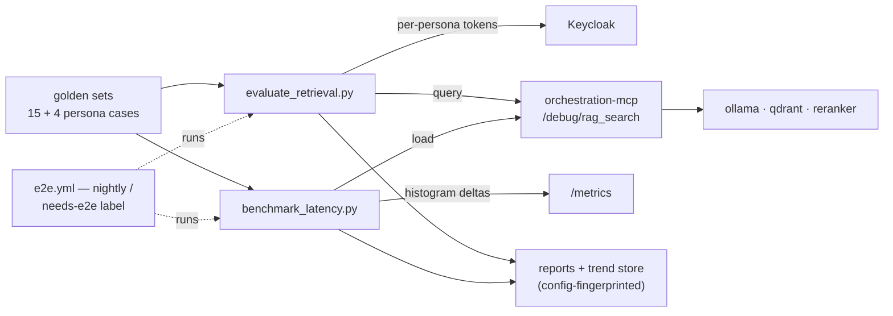

# Evaluation & performance baselines

Every number on this page was measured against a **live stack** — real
embeddings, real hybrid retrieval, real per-persona tokens — in CI, and is
tied to the run and config fingerprint that produced it.

<div class="grid cards" markdown>

-   **1.0** — recall@K · MRR · nDCG@K

    ---

    Every scored golden query returned its target **at rank 1**, including
    typo, vague, and non-admin-persona cases.

-   **0** — forbidden leaks (FR-26)

    ---

    No pending, rejected, superseded, or out-of-scope content reached any
    persona. The access filter held, live.

-   **3.6 docs** — abstention noise

    ---

    The one measured defect: off-topic queries return ~4 confident irrelevant
    documents. Fix: calibrate `RERANK_SCORE_FLOOR`.

-   **275 ms** — retrieval p95, single user

    ---

    End-to-end on a shared CI runner; 725 ms at 4-way concurrency. Proposed
    budget: **p95 ≤ 500 ms / ≤ 1 s**.

</div>

## Retrieval quality

15 golden cases — clean, paraphrase, typo, vague multi-part, abstention, and
per-persona coverage — against the 7-document dev corpus
(run 31093066661 · config `be0c106a29f0` · `nomic-embed-text`).

| Metric | Value | In one line |
|---|---|---|
| recall@K | **1.0** | no misses anywhere |
| MRR / nDCG@K | **1.0 / 1.0** | perfect ordering — the ceiling future runs regress from |
| precision@K | 0.32 | corpus-size artifact, not a defect |
| FR-26 leaks | **0** | across every persona |
| abstention noise | **3.6** | the open gap — see below |



Two readings worth spelling out:

- **Precision 0.32 is arithmetic, not quality** — with only 4 retrievable
  documents at `top_k=5`, almost everything comes back. It becomes a real
  signal once the corpus-scale work adds distractor documents.
- **The access-scope leg was proven live**: `bob-query` and `carol-curator`
  hold the clearance *and* releasability the Signal-Corps SECRET document
  requires — group scope alone excluded it, every time.

??? example "Gap analysis — the working dashboard (chart)"
    

    Left: each bar is a should-return-nothing query and how many documents it
    got anyway — after floor calibration these collapse to the green zero
    line. Right: who received which document; any red ✕ turning into a dot
    is an access-control regression visible at a glance.

??? example "Why rank-aware metrics exist (chart)"
    

    Set-membership recall scores rank 1 and rank 5 identically; MRR and nDCG
    don't. This demo is computed by the harness's own `rank_metrics()`.

??? example "Golden-set composition and persona coverage (chart)"
    

## Performance — latency and scaling (NFR-4)

11 queries × 5 reps per concurrency level (run 31097072539, shared GitHub
runner — treat the **stage split and trend** as the signal; absolute numbers
need one run on representative hardware).

| Stage | 1 user (p50 / p95) | 4 users (p50 / p95) |
|---|---|---|
| embed | 88 / 228 ms | 271 / 477 ms |
| retrieve (both legs) | 75 / 98 ms | 75 / 99 ms |
| rerank | 57 / 96 ms | 226 / 470 ms |
| **end-to-end** | **211 / 275 ms** | **593 / 725 ms** |



- **Bottleneck under load:** the CPU-bound model services queue (embed ~3×,
  rerank ~4×) while the vector store stays flat at ~75 ms.
- **Scaling levers, in order:** embedding replicas → reranker replicas →
  vector store last.

!!! tip "Proposed NFR-4 starting budget"
    Retrieval-side **p95 ≤ 500 ms single-user, ≤ 1 s at 4 concurrent** —
    today's shared runner already has 45% / 27% headroom under those lines.
    Generation is budgeted separately (it belongs to the chat plane).

## How the pieces fit



**Gates** (fail the build): recall miss · recall/precision regression ·
FR-26 leak. **Advisory** (tracked until their noise floor is known): MRR ·
nDCG · precision@k · abstention noise · latency. The document lifecycle these
harnesses exercise is in the
[architecture tour](guides/understanding-the-architecture.md).

## Reproduce it

=== "Docker Compose"

    The turnkey path — the seeded corpus and personas the gates expect are
    already there:

    ```bash
    docker compose up -d --wait
    docker compose --profile eval run --rm eval-retrieval        # quality + leak gate
    docker compose --profile eval run --rm benchmark-latency     # latency benchmark
    ```

=== "Helm / Kubernetes"

    The released `scripts` image ships both harnesses, and the chart enables
    `/debug/rag_search` by default. Run one-off pods inside the cluster:

    ```bash
    kubectl run eval-retrieval --rm -it --restart=Never \
      --image=ghcr.io/schuecl/nexus-rag/scripts:X.Y.Z \
      --env ORCHESTRATION_MCP_URL=http://<release>-orchestration-mcp:8002 \
      --env KEYCLOAK_URL=http://<your-keycloak-svc>:8080 \
      --env RAG_APP_KEYCLOAK_CLIENT_SECRET=<rag-app client secret> \
      -- python3 evaluate_retrieval.py
    ```

    ```bash
    kubectl run benchmark-latency --rm -it --restart=Never \
      --image=ghcr.io/schuecl/nexus-rag/scripts:X.Y.Z \
      --env ORCHESTRATION_MCP_URL=http://<release>-orchestration-mcp:8002 \
      --env KEYCLOAK_URL=http://<your-keycloak-svc>:8080 \
      --env RAG_APP_KEYCLOAK_CLIENT_SECRET=<rag-app client secret> \
      -- python3 benchmark_latency.py
    ```

    Air-gapped: same commands with your internal registry prefix — the
    `scripts` image is one of the five in every release bundle.

    !!! warning "The golden gate assumes the dev fixtures"
        Its pass/fail contract targets the **seeded sample corpus and
        dev-realm personas**. Against a production realm, run in a staging
        namespace with those fixtures loaded — or bring your own golden set
        (`--golden-set` / `--persona-set`, `EVAL_PERSONA`). The **latency
        benchmark** has no corpus expectations and is meaningful against any
        populated deployment: its numbers on your hardware are exactly what
        the NFR-4 budget wants.

Reports carry a **config fingerprint** (models, floor, chunking, golden-set
hash, persona) — compare runs only within a fingerprint; cross-config
comparisons are refused or loudly annotated by design.

## Sources

- [`scripts/evaluate_retrieval.py`](https://github.com/schuecl/nexus-rag/blob/main/scripts/evaluate_retrieval.py)
  and
  [`scripts/benchmark_latency.py`](https://github.com/schuecl/nexus-rag/blob/main/scripts/benchmark_latency.py)
  — the harnesses; their docstrings define every metric and gate
- [Testing & CI quality gates](testing.md) — the gated-vs-advisory
  convention and re-evaluation policy
- CI runs [31093066661](https://github.com/schuecl/nexus-rag/actions/runs/31093066661)
  (quality) and
  [31097072539](https://github.com/schuecl/nexus-rag/actions/runs/31097072539)
  (latency) — the artifacts behind every number above
