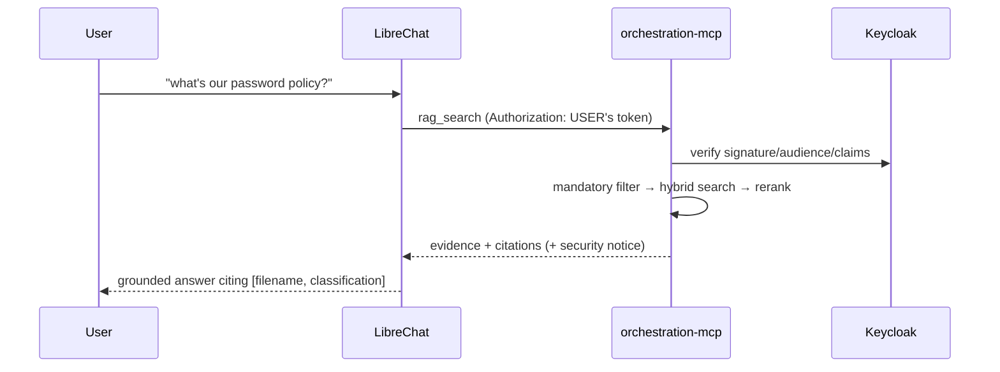

# Connect the chat plane (LibreChat + MCP)

Retrieval is only half the experience — this guide wires the corpus into
LibreChat so a user can *chat* with it, with every tool call running under
**their own identity**. Three ways to query, in increasing order of moving
parts; retrieval and access control are identical in all three.

| Way | Exercises | Use when |
|---|---|---|
| **1. Debug endpoint** (curl) | retrieval + per-user filter + reranking | verifying the security-critical path |
| **2. LibreChat Agent** | the full chat UX with tool execution | the intended end-user experience |
| **3. Plain model chat + tool** | the generation hop | debugging only |

Way 1 is covered in the [Quickstart](quickstart.md). This page is way 2.

## 1. One-time host setup (dev TLS)

LibreChat's OIDC login refuses a plain-HTTP issuer, so the dev stack fronts
it with HTTPS — which needs a locally-trusted CA and a hostname alias, once
per workstation:

```bash title="generate the dev CA + certs"
infra/certs/generate-dev-certs.sh
```

```bash title="trust the CA (RHEL/Fedora shown; browsers have their own store)"
sudo cp infra/certs/ca.crt /etc/pki/ca-trust/source/anchors/nexus-rag-dev-ca.crt
sudo update-ca-trust
```

```bash title="let the browser resolve Keycloak by its compose-network name"
echo "127.0.0.1 keycloak" | sudo tee -a /etc/hosts
```

!!! failure "Skip a step and…"
    a missing CA trust surfaces as a TLS error / browser cert warning at the
    Keycloak redirect; a missing hosts entry surfaces as the browser failing
    to resolve `keycloak` after login. Full detail (including per-browser
    `certutil` commands) in [Dev environment setup](../dev-setup.md).

## 2. Log in and create the agent

1. Open <https://localhost:3080> and log in via Keycloak (e.g. `dave-admin`).
   **The user must have logged in once** before the next step.
2. Create the checked-in **RAG Assistant** agent for that user:

    ```bash
    scripts/create_librechat_agent.sh dave-admin
    ```

    An *Agent* is required for reliable MCP tool execution — a plain chat
    with the tool toggled on advertises it but doesn't run LibreChat's tool
    loop.

## 3. Connect the tool, once

In LibreChat: endpoint selector → **Agents** → **RAG Assistant**. The first
message will surface a **Connect** button on the `rag` tool — clicking it
runs a real OAuth login against Keycloak (standard authorization-code flow,
one consent per user). From then on:



The token LibreChat sends is *the user's own* — expired bearers get an RFC
6750 `401`, LibreChat refreshes and retries, and disconnect revokes at
Keycloak. There is no service account impersonating users anywhere in this
path.

## 4. Prove it end to end

Ask the agent *"how often should passwords be rotated?"* — expect a grounded
answer citing `[password-policy.md, CUI]`. Then the access-control proof:
log out, log in as `bob-query`, connect, and ask about the incident-response
plan — bob's answer comes back empty-handed, because the retrieval his token
authorized never returned the Signal-Corps-scoped document.

!!! note "Generation is deliberately out of scope"
    The RAG plane returns evidence with citations; answer *generation*
    belongs to the chat plane (LibreChat → LiteLLM → your models). That
    boundary is why generated answers must never be treated as authoritative
    markings — verify against the cited source.

## Sources

- [Querying the corpus](../querying-the-corpus.md)
  (`docs/querying-the-corpus.md`) — all three query paths and the
  tool-calling lessons learned live
- [Dev environment setup](../dev-setup.md) — the one-time TLS/hosts setup in
  full, and the six real bugs behind the MCP OAuth design
- [`infra/librechat/agents/rag-assistant.json`](https://github.com/schuecl/nexus-rag/blob/main/infra/librechat/agents/rag-assistant.json)
  — the checked-in agent definition
