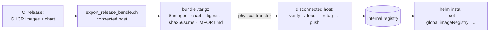

# Deploy air-gapped

The connected/disconnected boundary is explicit and crossed exactly once per
release: CI publishes versioned artifacts, a human builds and verifies a
transfer bundle on the connected side, carries it across, and the cluster
only ever sees the internal registry. Nothing on the disconnected side pulls
from the internet — models included (they're baked into or cached by the
pinned images).



## Connected side — build the bundle

One host prerequisite that has bitten before: the Docker daemon must use the
classic `overlay2` storage driver. On a containerd-snapshotter daemon,
`docker save` has been observed to exit 0 while **silently omitting every
image layer** — the export script detects this and refuses, but check first:

```bash
docker info | grep -i "storage driver\|driver-type"
# wanted:  Storage Driver: overlay2   (and no driver-type line)
```

??? note "Snapshotter active? Disable it"
    ```bash
    sudo tee /etc/docker/daemon.json <<'EOF'
    {
      "features": { "containerd-snapshotter": false }
    }
    EOF
    sudo systemctl restart docker   # drops running containers
    ```

Then, for released version `X.Y.Z`:

```bash
scripts/export_release_bundle.sh X.Y.Z
# -> dist/nexus-rag-X.Y.Z-bundle.tar.gz
```

The script pulls the published artifacts (it never rebuilds), verifies every
image tar blob-by-blob against its OCI manifest, hard-fails unless the chart
pins exactly the five `X.Y.Z` images, and emits:

| In the bundle | Purpose |
|---|---|
| `images/*-X.Y.Z.tar` ×5 | `docker load`-able archives of the service images |
| `nexus-rag-X.Y.Z.tgz` | the Helm chart |
| `image-digests.txt` | GHCR RepoDigests for post-transfer comparison |
| `sha256sums.txt` | checksums over everything above |
| `IMPORT.md` | the disconnected-side runbook, generated per release |

## Disconnected side — verify, import, deploy

```bash
tar xzf nexus-rag-X.Y.Z-bundle.tar.gz && cd nexus-rag-X.Y.Z

sha256sum -c sha256sums.txt        # ALWAYS first — a failed line means stop

for img in images/*.tar; do docker load -i "$img"; done

# retag into the internal registry (same bare names the chart uses)
for svc in ingestion-api ingestion-worker orchestration-mcp reranker-service; do
  docker tag "ghcr.io/schuecl/nexus-rag/${svc}:X.Y.Z" \
    "registry.internal.example.mil/nexus-rag/${svc}:X.Y.Z"
  docker push "registry.internal.example.mil/nexus-rag/${svc}:X.Y.Z"
done

helm install nexus-rag ./nexus-rag-X.Y.Z.tgz \
  --set global.imageRegistry=registry.internal.example.mil/nexus-rag \
  -f my-values.yaml
```

Third-party images (Postgres, Qdrant, NATS, Keycloak…) are version-pinned in
`values.yaml` and mirrored with the same retag-and-push pattern; they change
rarely, and a release-to-release `values.yaml` diff lists exactly which.

!!! danger "The verification is the point"
    `sha256sums.txt` then `image-digests.txt` are what make the transferred
    bytes *provably* the released bytes. Skipping them turns a controlled
    import into trusting a USB stick. The Secrets contract and values setup
    are the same as any [Helm deployment](deploy-helm.md) — do that
    preparation before the transfer window, not during it.

## What "air-gapped" means for operations

- **Identity comes with you.** Keycloak runs inside the boundary; the realm
  is imported at deploy time from a transformed export (explicit redirect
  URIs, TLS required, no dev users or secrets), and services fetch JWKS
  from the internal issuer only. The full walkthrough — claims contract,
  realm migration script with dummy enclave hostnames, CA-trust and DNS
  requirements — is on the [Identity & OIDC](identity-oidc.md) page.
- **Updates** are new bundles, same flow — versions move in lockstep across
  all five images and the chart, and immutable releases make any prior
  version redeployable.
- **Quality evaluation** runs inside: the eval harness and latency benchmark
  are ordinary in-cluster/compose jobs against your own stack, and their
  reports carry a config fingerprint so your baselines stay yours.
- **This documentation site** builds fully offline (mermaid and all assets
  are vendored) — `mkdocs build` in the repo produces a static `site/` you
  can serve anywhere inside the boundary.

## Sources

- [Releasing](../releasing.md) (`docs/releasing.md`) — the canonical
  air-gapped deployment section, versioning scheme, and the
  snapshotter incident detail
- [`scripts/export_release_bundle.sh`](https://github.com/schuecl/nexus-rag/blob/main/scripts/export_release_bundle.sh)
  — the bundle builder; its generated `IMPORT.md` is the per-release runbook
- [Deploy with Helm](deploy-helm.md) — the Secrets/values contract the
  disconnected install still needs
