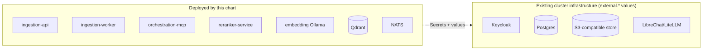

# Deploy with Helm (Kubernetes)

The **production** path — for a local Kubernetes *sandbox* (throwaway dev
Postgres/Keycloak, seeded corpus), use the
[Kubernetes quickstart](quickstart-helm.md) instead. The chart deploys **only what this project adds** — the
four custom services, a dedicated embedding Ollama, Qdrant (or Milvus), NATS,
and optionally SeaweedFS — and *integrates* with what your cluster already
runs: Keycloak, Postgres, the object store, and the LibreChat/LiteLLM chat
plane are configuration, not bundled dependencies.



## Before you install — the Secrets contract

The chart **fails closed**: it renders nothing rather than deploying broken
auth. Pre-create these (names/keys configurable in `values.yaml`):

| Secret for | Contains | Generate with |
|---|---|---|
| `externalPostgres` | full SQLAlchemy `DATABASE_URL` | your DBA |
| `externalKeycloak.clientSecret` | the `rag-app` confidential-client secret | Keycloak admin |
| `ingestionApi.sessionTokenEncryption` | Fernet key encrypting stored OIDC tokens at rest | `python3 -c "from cryptography.fernet import Fernet; print(Fernet.generate_key().decode())"` |
| `qdrant.apiKey` | read/write key **and** read-only key (retrieval gets RO only) | `openssl rand -hex 32` ×2 |
| `nats.credentials.*` | publisher and consumer passwords (publish-only / consume-only enforced per subject) | your secret practice |
| `objectStore.external` | S3 access + secret key | your storage team |

Also required: either `ingestionApi.ingress.host` or an explicit
`ingestionApi.oidcRedirectUri` — otherwise the render fails rather than
shipping a broken OIDC callback. The full identity contract behind these
values — claims schema, realm review, what changes when hostnames change,
and the dev→air-gapped realm migration — is on its own page:
[Identity & OIDC](identity-oidc.md).

!!! tip "Why so many Secrets?"
    Least privilege is structural here: retrieval holds a read-only vector
    key, the queue publisher can't consume, no service can read the audit
    log, and stored browser tokens are useless without the Fernet key. Each
    Secret is one blast-radius boundary.

## Install

```bash
helm lint helm/nexus-rag
helm template helm/nexus-rag --debug \
  --set ingestionApi.ingress.enabled=true \
  --set ingestionApi.ingress.host=rag.example.internal   # render-check YOUR values first

helm install nexus-rag helm/nexus-rag \
  -f my-values.yaml
```

=== "Connected cluster"

    Images pull from GHCR as pinned in `values.yaml` — every tag is an exact
    version, floating tags are CI-rejected (NFR-16). Keycloak realm/client
    per the requirements' claims schema (adapt the dev realm export under
    `infra/keycloak/realm-export/`).

=== "Air-gapped cluster"

    Same chart, one override:

    ```bash
    helm install nexus-rag ./nexus-rag-X.Y.Z.tgz \
      --set global.imageRegistry=registry.internal.example.mil/nexus-rag
    ```

    `global.imageRegistry` + bare image names exist for exactly this — no
    values surgery per release. Getting the images *into* that registry is
    the verified-bundle flow: [Deploy air-gapped](deploy-airgapped.md).

## After install

- Register `orchestration-mcp` as an MCP server in **LibreChat's own config**
  (OAuth against Keycloak — the user clicks *Connect* once; their queries
  then run under their own identity, which is the whole point).
- NetworkPolicies ship with the chart: retrieval can't reach ingestion's
  stores and vice versa; `/metrics` scraping requires explicitly allowing
  your Prometheus.
- The chart's hardening (non-root, no-new-privileges, read-only rootfs) is
  mirrored by the dev compose stack and CI-checked, so what you deploy is
  what every dev run and e2e already exercised.

## Network requirements — plan these before the air gap

On Tanzu this section is the hand-off to your NSX/Avi administrator: inside
an air-gapped TKG cluster, **this is the complete network story** — every
flow below plus DNS and NTP, and *nothing else*. The stack needs **zero
internet egress at runtime** (models are baked into or mirrored with the
images; nothing downloads after deploy).

### The traffic matrix

| From | To | Port | Purpose |
|---|---|---|---|
| Ingress / Avi / Contour | ingestion-api | 8001 | browser UI (upload, curate, search) |
| LibreChat (chat plane) | orchestration-mcp | 8002 | the `rag_search` MCP tool |
| ingestion-api | orchestration-mcp | 8002 | the UI search page proxies retrieval |
| orchestration-mcp | Qdrant | 6333 (+6334 gRPC) | filtered hybrid search (read-only key) |
| orchestration-mcp | reranker-service | 8003 | candidate reranking |
| orchestration-mcp | embedding-service | 11434 | query embedding |
| ingestion-worker | embedding-service | 11434 | document embedding (+ optional vision/classification models) |
| ingestion-worker / ingestion-api | Qdrant | 6333 | write / curation payload updates |
| ingestion-api / ingestion-worker | NATS | 4222 | durable job queue (publish / consume, per-subject credentials) |
| ingestion-api / ingestion-worker | Postgres (external) | 5432 | system of record |
| ingestion-api / ingestion-worker | S3 / SeaweedFS | 8333 (bundled) or your S3's port | original document bytes |
| all four services | Keycloak (external) | 443 | JWKS fetch + OIDC flows |
| your Prometheus | each service `/metrics` | service port | monitoring — **must be explicitly allowed** through the default-deny |

### What the chart already enforces — and what it leaves to you

The chart ships **default-deny ingress NetworkPolicies with per-component
allowlists for every data-plane backend** (Qdrant/Milvus, NATS,
reranker-service, embedding-service, SeaweedFS). The reason is structural:
access control is enforced at orchestration-mcp — the vector store applies
whatever filter it's handed and stores chunk text in cleartext, and the
reranker takes no credential at all. The policies make "who can open a
socket to those" a short, named list instead of "any pod in the namespace."

Deliberately left to the deployment (the chart can't know your topology):

- **Who may reach ingestion-api :8001 and orchestration-mcp :8002** — on
  Tanzu, express this in NSX DFW or your own NetworkPolicies: ingress
  controller → :8001; the LibreChat pods/VMs → :8002; nothing else.
- **Egress restriction** — the services must reach *your* external
  Keycloak/Postgres/S3, whose addresses only you know.
  `networkPolicy.denyEgressByDefault` is available once you're ready to
  supply the allow rules; NSX DFW is the natural place on Tanzu.

!!! warning "NetworkPolicies are only real if the CNI enforces them"
    TKG's default CNI (Antrea) enforces them — good. But verify rather than
    assume: on a non-enforcing CNI, Kubernetes accepts the policies silently
    and protects nothing. `kubectl exec` a scratch pod and try to reach
    Qdrant directly; a timeout is the correct answer.

### DNS, NTP, identity — the quiet requirements

- **One canonical Keycloak hostname**, resolvable identically by user
  browsers *and* pods, over TLS your platform trusts. The sandbox tolerates
  a two-hostname issuer allowlist; production should not need it — token
  `iss` values must match what services verify.
- **NTP everywhere** — token validation is clock-sensitive, and TKG
  requires host NTP anyway.
- **Cluster DNS** resolves all in-cluster service names in the matrix; the
  external names (Keycloak, Postgres, S3, Harbor) come from your enclave DNS.

!!! note "Sandbox → Tanzu: what changes"
    The [minikube sandbox](quickstart-helm.md) runs all of this with
    port-forwards and permissive networking — it validates the *application*
    wiring, not the network posture. The matrix above is precisely the delta
    you provision when promoting to TKG: Avi/ingress in front, NSX rules for
    the two user-facing services, the chart's own policies doing the
    data-plane isolation, and the air-gapped registry (Harbor) already
    holding the [bundle-imported images](deploy-airgapped.md).

## Platform notes

The chart is platform-neutral Kubernetes; what differs per distribution is
storage, ingress/load-balancing, security admission, and where images live.

??? note "VMware Tanzu Kubernetes Grid (TKG) / vSphere"
    Likely the closest match to this project's target environment. Deploy
    into a **workload cluster** (created via the Tanzu CLI from your
    management cluster or vSphere Supervisor) — never into the management
    cluster. Platform specifics that map onto this chart:

    - **Registry:** TKG environments typically run **Harbor** (a Tanzu
      standard package) as the internal registry — that's exactly what
      `global.imageRegistry` points at, and the
      [air-gapped bundle flow](deploy-airgapped.md) retags into it.
      TKG's own air-gapped reference design covers mirroring the platform
      images; this chart's five app images ride the same pattern.
    - **Ingress / LB:** control-plane and Service load-balancing come from
      kube-vip or Avi Load Balancer; `ingestionApi.ingress` rides whatever
      ingress controller (e.g. Contour, another standard package) the
      cluster provides — set the class/annotations in your values.
    - **Storage:** the chart's PVCs (Qdrant, NATS, optionally SeaweedFS)
      bind to the cluster's default StorageClass — vSphere CSI in TKG;
      confirm one exists or set `*.persistence.storageClassName`.
    - **Compliance fit:** TKG releases are validated against DISA STIG and
      NSA/CISA Kubernetes hardening — that covers the *platform* layer;
      this chart's own hardening (non-root, `cap_drop: ALL`, read-only
      rootfs, NetworkPolicies) layers the *application* controls on top.
      The two are complementary, not redundant.
    - **Lifecycle:** TKG runs an N-2 support policy — align your base-OS/
      Kubernetes (TKr) pins with the same discipline this repo applies to
      images and models, and mind NTP: Keycloak token validation is
      clock-sensitive, and TKG requires NTP on hosts anyway.

??? note "OpenShift"
    The chart's securityContext (fixed non-root UID 10001, no privilege
    escalation, dropped capabilities, read-only rootfs) is written to the
    same posture as the `restricted` SCC family — but OpenShift assigns
    project UID ranges, so verify the explicit `runAsUser` against your
    SCC (or grant a scoped `nonroot`/custom SCC) before assuming admission
    passes. Routes can replace Ingress for `ingestionApi` exposure.

??? note "Managed clusters (EKS / AKS / GKE)"
    Straightforward: a default StorageClass exists, LoadBalancer Services
    provision cloud LBs, and the registry is ECR/ACR/GAR — set
    `global.imageRegistry` + `global.imagePullSecrets` (or the cloud's
    workload-identity pull integration). The air-gapped flow doesn't apply;
    the [connected-cluster tab](#install) above is your path.

!!! warning "Render what you deploy"
    CI lints and renders the chart only with near-default values. Combinations
    like `vectorBackend: milvus` or the `external.*` blocks are supported but
    not CI-rendered — `helm template --debug` your exact values file before
    trusting it.

## Sources

- [Helm chart README](https://github.com/schuecl/nexus-rag/blob/main/helm/nexus-rag/README.md)
  (`helm/nexus-rag/README.md`) — the canonical prerequisites list, every
  value documented, object-store and NATS auth details
- [Releasing](../releasing.md) — version lockstep, what a release contains
- [Observability](../observability.md) — wiring the chart's metrics into a
  cluster Prometheus
