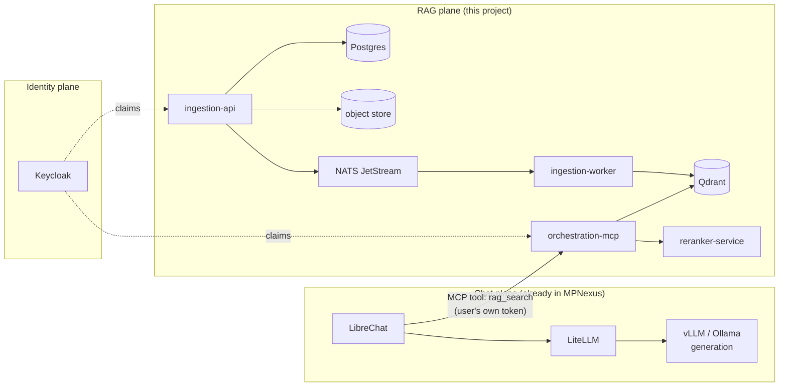
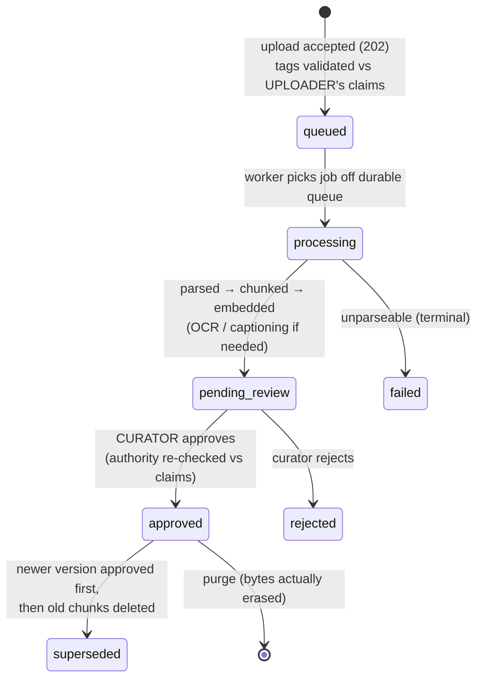

# Understanding the architecture

One system, three planes, and a single security idea applied everywhere:
**every access decision derives server-side from verified identity claims,
and nothing is retrievable until a human approves it.** This page is the
guided tour; the [full diagram set](../architecture/diagrams.md) and the
[complete architecture reference](../architecture-overview.md) go deeper.

## The three planes

- **Chat plane** — LibreChat, LiteLLM and the generation models already run
  in MPNexus. This project doesn't generate text; it hands the chat plane
  *evidence with citations*.
- **RAG plane** — the four services this repo adds, plus their stores.
- **Identity plane** — Keycloak issues the OIDC tokens whose claims
  (`clearance`, `releasability`, `groups`, `org`, `rag_roles`) drive every
  decision below. One shared library parses them; no service trusts a
  client-supplied value.

## A document's life

Three properties worth internalizing:

1. **`pending_review` chunks exist in the vector store but cannot be
   retrieved.** The mandatory filter demands `status == approved`
   unconditionally — curation is the gate to retrievability, not a workflow
   nicety.
2. **Ingestion is crash-safe.** The worker acknowledges a queue message only
   on a terminal outcome; a crash mid-embed means redelivery, not a lost
   document.
3. **Supersession has no dead window.** The new version's chunks flip to
   approved *before* the old version's are deleted — there is never a moment
   where neither version answers.

## What happens on a query

The user asks LibreChat something; LibreChat calls the `rag_search` MCP tool,
forwarding *that user's own token*:

1. Claims parsed and verified (signature, audience, `rag-query` role).
2. A **mandatory filter** is built server-side:
   `status == approved` **and** `classification ≤ clearance` **and**
   `releasability` overlaps holdings **and** `access_scope` overlaps the
   user's groups/org.
3. **Two retrieval legs run in parallel** — dense (embedding similarity) and
   BM25 (keyword) — *each* with the full filter applied. Neither leg can be a
   bypass.
4. Results fuse by Reciprocal Rank Fusion, then a cross-encoder reranks the
   candidates (if the reranker is down, fused order is served and the
   response says so).
5. Chunks return with source, classification and provenance metadata; OCR'd
   content is flagged so the model hedges ("the scanned copy reads…").
6. The attempt is audit-logged — success, denial, or backend failure — by
   identity, with **no query text** (a question asked of a classified corpus
   is itself sensitive).

!!! danger "The invariant that matters"
    Filtering happens **inside the vector store query**, on both legs, from
    claims the server verified. There is no code path where a chunk is
    fetched first and filtered after — and the live evaluation proves it:
    zero forbidden-status leaks across every persona, with the
    group-scoped SECRET document verifiably invisible to users holding the
    right clearance but the wrong group (see
    [Evaluation results](../evaluation-results.md)).

## Where data actually lives

| Store | Holds | Why it's separate |
|---|---|---|
| Postgres | Document rows + status, audit log (append-only), notifications, admin vocabularies | Transactional system of record |
| Qdrant (or Milvus) | One point per chunk: dense + sparse vectors, text, and a copy of the access-control fields | Retrieval filters without a round-trip to Postgres |
| Object store | Original uploaded bytes | Durability + reprocessing, write-only from the app |

The vector backend is a build-time-free switch: `VECTOR_BACKEND=qdrant`
(default) or `milvus` — same pipeline, same mandatory filter semantics
(Qdrant: one collection per classification level; Milvus: one partition per
level), one backend per deployment. Switching means re-ingesting; vectors
don't copy across stores.

## Next steps

- [Quickstart](quickstart.md) — see all of this run
- [Full diagram set](../architecture/diagrams.md) — nine mermaid diagrams,
  from system context to Helm topology
- [Roles and permissions](../roles-and-permissions.md) — the authorization
  matrix, route by route

## Sources

- [Architecture reference](../architecture-overview.md) (`ARCHITECTURE.md`) —
  component inventory, data model, per-flow sequence diagrams
- [Requirements](../requirements.md) (`REQUIREMENTS.md`) — the FR/NFR
  baseline every design decision traces to
- [Data governance](../governance.md) and
  [Privacy threat model](../threat-model.md) — the security reasoning in full
